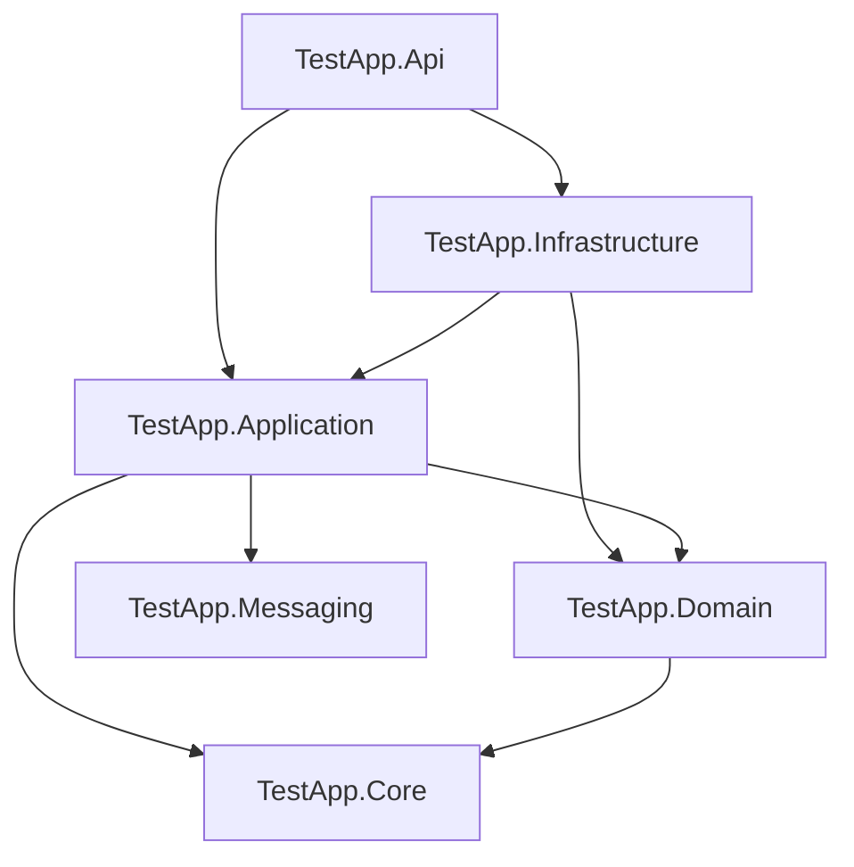
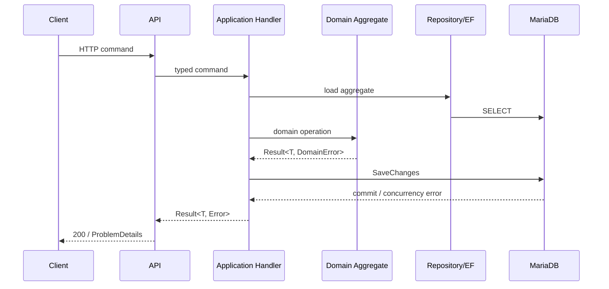
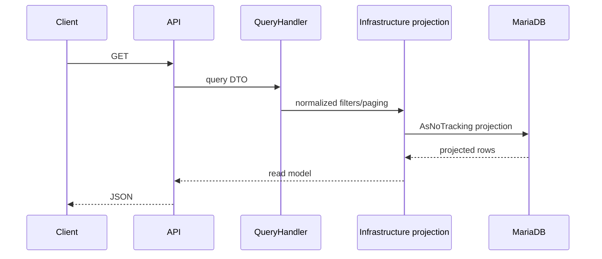

# Архитектура TestApp

> Статус: **Implemented architecture** + явно выделенный технический долг.

## 1. Архитектурный стиль

TestApp развивается как **modular monolith** на .NET 10. Основные принципы:

- Domain-Driven Design для бизнес-инвариантов;
- Clean Architecture для направления зависимостей;
- CQRS на уровне application/read-side разделения;
- Minimal API как transport boundary;
- MariaDB как единственная transactional source of truth;
- Keycloak как внешний source of truth для identity;
- transactional Outbox для будущих/текущих integration events;
- RabbitMQ как opt-in transport;
- background workers внутри того же deployable API process.

Проект **не является** набором микросервисов и не использует Event Sourcing.

## 2. Solution structure

```text
src/
  TestApp.Core
  TestApp.Domain
  TestApp.Messaging
  TestApp.Application
  TestApp.Infrastructure
  TestApp.Api

tests/
  TestApp.Domain.Tests
  TestApp.Application.Tests
  TestApp.IntegrationTests
```

### 2.1 Dependency graph



Фактические project references:

- `TestApp.Domain -> TestApp.Core`;
- `TestApp.Application -> TestApp.Core + TestApp.Domain + TestApp.Messaging`;
- `TestApp.Infrastructure -> TestApp.Application + TestApp.Domain`;
- `TestApp.Api -> TestApp.Application + TestApp.Infrastructure`.

`TestApp.Messaging` не зависит от Domain/Application и содержит CQRS messaging abstractions.

## 3. Обязанности слоёв

### TestApp.Core

Минимальные общие primitives, не зависящие от ASP.NET Core/EF/Keycloak.

### TestApp.Domain

Содержит:

- aggregates и entities;
- strong IDs;
- business invariants;
- domain errors;
- domain events;
- immutable publication model;
- scoring/state transitions.

Domain **не должен** ссылаться на:

- `HttpContext`;
- `ClaimsPrincipal`;
- JWT;
- Keycloak SDK;
- EF Core;
- RabbitMQ;
- OpenTelemetry;
- transport DTO.

### TestApp.Messaging

Содержит generic `ICommand`, `IQuery`, handlers abstractions. Это не broker integration layer.

### TestApp.Application

Содержит use cases:

- commands/queries;
- repository/UoW/actor/clock/idempotency abstractions;
- permission-independent business orchestration;
- transport-neutral `Error`;
- CQRS read contracts.

Application не знает о MariaDB SQL, RabbitMQ client и ASP.NET endpoint routing.

### TestApp.Infrastructure

Реализует:

- EF Core/MariaDB persistence;
- repositories/read models;
- optimistic concurrency mapping;
- MariaDB advisory locks;
- persistent idempotency store;
- Keycloak claim mapping/current actor;
- Outbox processing;
- RabbitMQ publisher/readiness;
- audit trail;
- health checks;
- OpenTelemetry;
- background attempt expiration worker.

### TestApp.Api

Содержит:

- Minimal API routing;
- JWT Bearer setup;
- authorization policies;
- transport request records;
- ProblemDetails mapping;
- API version path;
- legacy rewrite;
- rate limiting;
- correlation/audit middleware;
- DI composition root.

## 4. Write-side flow

Типовой write flow:



Ключевой принцип: бизнес-инварианты проверяются aggregate/domain method, а не endpoint code.

## 5. Read-side flow



Read-side не обязан materialize aggregates. Для каталога/результатов/assignment administration используются отдельные projection DTO.

## 6. HTTP request pipeline

Текущий порядок middleware/endpoint setup концептуально:

```text
legacy /api/* -> /api/v1/* rewrite
        ↓
UseRouting
        ↓
RequestTelemetryMiddleware
        ↓
ExceptionHandler
        ↓
Authentication
        ↓
CorrelationAuditMiddleware
        ↓
RateLimiter
        ↓
Authorization
        ↓
Minimal API endpoint
```

OpenAPI доступен через `/openapi/v1.json`.

### Почему rewrite выполняется до routing

Legacy compatibility меняет `Request.Path`, поэтому canonical route должен быть выбран после rewrite. Если rewrite выполнить после endpoint routing, выбранный endpoint не пересчитывается и старые URLs получают 404.

## 7. Background processing

### 7.1 OverdueAttemptProcessor

**Всегда зарегистрирован** через Infrastructure.

- batch size default: 100;
- poll interval default: 30 seconds;
- выбирает IDs просроченных `InProgress` attempts;
- каждая попытка обрабатывается в отдельном DI scope;
- application handler повторно проверяет state/deadline;
- optimistic concurrency безопасно разрешает гонку с submit.

### 7.2 OutboxProcessor

Регистрируется только когда подключён реальный publisher (`RabbitMq:Enabled=true` для RabbitMQ path).

- default batch size 100;
- poll interval 5 seconds;
- retry exponential backoff;
- max attempts 10;
- MariaDB advisory lock по OutboxMessage ID;
- at-least-once delivery.

## 8. Concurrency model

Все основные aggregates наследуют `AggregateRoot<TId>` и имеют `ConcurrencyVersion`.

EF mapping использует его как concurrency token. Business mutation вызывает `Touch()`. При конфликте:

```text
DbUpdateConcurrencyException
    -> ConcurrencyConflictException
    -> API ProblemDetails HTTP 409
```

Это защищает от lost updates между несколькими API requests/instances.

## 9. Idempotency architecture

Два механизма существуют сознательно.

### Start attempt

Специализированная DB-safe модель:

- `StartRequestId` хранится в `test_attempts`;
- unique `(AssignmentId, UserId, StartRequestId)`;
- attempt limit проверяется внутри serializable transaction.

### Publish/assign/bulk-assign/submit

Общий `IdempotencyStore`:

1. lookup cached result;
2. MariaDB `GET_LOCK` по hash(database + operation + actor + requestId);
3. повторный lookup после lease;
4. use case;
5. insert `idempotency_records`;
6. business result + idempotency result commit одной UoW;
7. `RELEASE_LOCK`.

## 10. Event boundaries

Aggregate может поднимать `IDomainEvent`. `AppDbContext.SaveChangesAsync()` помещает в Outbox **только** `IIntegrationEvent`.

Это разделение запрещает неосознанно публиковать внутренние domain details наружу.

Текущие бизнес-события вроде `TestPublished`, `TestAssigned`, `AttemptSubmitted` — domain events. Integration contracts должны создаваться явно как стабильные внешние schemas.

## 11. Runtime dependencies

- MariaDB 12.3 — required;
- Keycloak — required для нормальной JWT authentication runtime;
- RabbitMQ — optional, только если `RabbitMq:Enabled=true`;
- OTLP collector — optional;
- Docker — не требуется приложению, но используется для стандартного deployment/dev stack.

## 12. Architectural constraints для новых фич

Новая фича должна соблюдать:

1. Domain не получает Infrastructure/API dependencies.
2. Endpoint не содержит бизнес-правила, кроме transport parsing/policy selection.
3. Student read models не раскрывают `IsCorrect`.
4. Published revision не меняется после публикации.
5. Assignment всегда ссылается на revision, не на mutable Test.
6. Cross-instance retry hazard должен иметь DB-backed idempotency/concurrency strategy.
7. Integration event должен быть отдельным явным contract, а не «любой domain event».
8. Read-side filtering/paging должен выполняться в SQL до materialization, если это технически возможно.

## 13. Текущие архитектурные gaps

- нет `Test.OwnerId/CreatedBy`;
- нет tenant/team boundary;
- handlers регистрируются напрямую в API, нет общего command/query dispatcher pipeline для validation/logging/idempotency;
- idempotency пока body-based, а не HTTP header standard;
- rate limit hard-coded;
- нет формального API deprecation/version lifecycle;
- migrations поддерживаются explicit files, но полноценный EF model snapshot отсутствует;
- Outbox transport готов, но production integration event catalog ещё не определён;
- нет separate read database/cache — и сейчас это сознательно не требуется.

## 14. Когда разделять монолит

Не следует выделять микросервисы только ради масштаба кода. Разделение имеет смысл, если появится конкретный operational/business pressure:

- независимый release cadence;
- отдельная ownership команда;
- значимо разные scaling profiles;
- тяжёлые analytics/workloads, мешающие transactional API;
- независимые security/compliance boundaries.

До появления этих факторов modular monolith остаётся предпочтительной архитектурой.