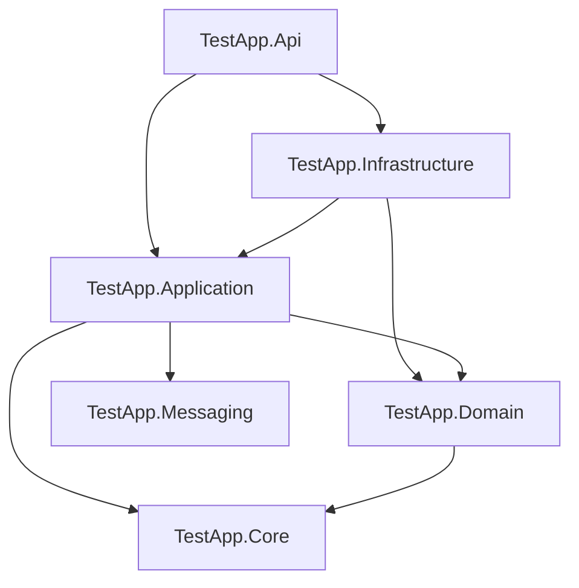
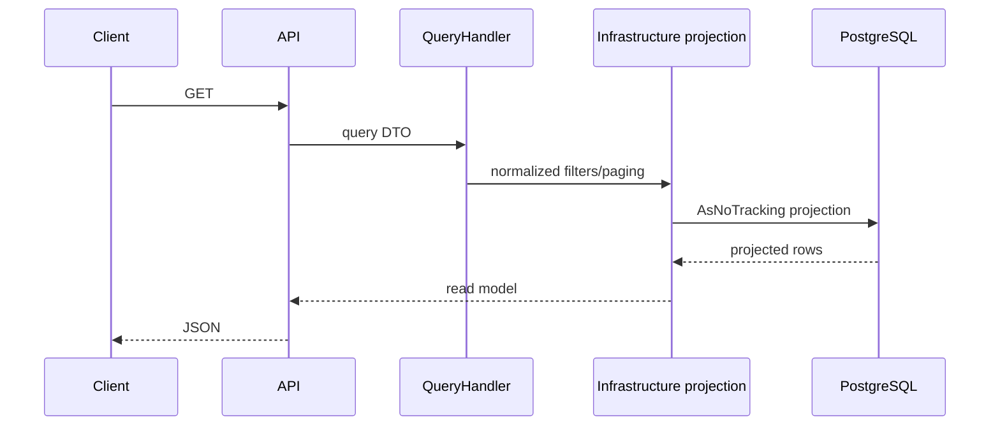

# Архитектура TestApp

> Статус: **Implemented architecture** + явно выделенный технический долг.

## 1. Архитектурный стиль

TestApp развивается как **modular monolith** на .NET 10. Основные принципы:

- Domain-Driven Design для бизнес-инвариантов;
- Clean Architecture для направления зависимостей;
- CQRS на уровне application/read-side разделения;
- Minimal API как transport boundary;
- PostgreSQL как единственная transactional source of truth;
- Keycloak как внешний source of truth для identity;
- transactional Outbox для будущих/текущих integration events;
- RabbitMQ как opt-in transport;
- background workers внутри того же deployable API process.

Проект **не является** набором микросервисов и не использует Event Sourcing.

## 2. Структура решения

```text
src/
  TestApp.Core
  TestApp.Domain
  TestApp.Messaging
  TestApp.Application
  TestApp.Infrastructure
  TestApp.Api

tests/
  TestApp.Domain.Tests
  TestApp.Application.Tests
  TestApp.IntegrationTests
```

### 2.1 Граф зависимостей



Фактические project references:

- `TestApp.Domain -> TestApp.Core`;
- `TestApp.Application -> TestApp.Core + TestApp.Domain + TestApp.Messaging`;
- `TestApp.Infrastructure -> TestApp.Application + TestApp.Domain`;
- `TestApp.Api -> TestApp.Application + TestApp.Infrastructure`.

`TestApp.Messaging` не зависит от Domain/Application и содержит CQRS messaging abstractions.

## 3. Обязанности слоёв

### TestApp.Core

Минимальные общие primitives, не зависящие от ASP.NET Core/EF/Keycloak. Текущий реально используемый functional primitive — `Result<TValue, TError>`; speculative `Option`/`Validation` удалены до появления подтверждённого use case.

### TestApp.Domain

Содержит:

- aggregates и entities;
- строго типизированные идентификаторы;
- бизнес-инварианты;
- доменные ошибки;
- доменные события;
- неизменяемая модель публикации;
- оценивание и переходы состояний.

Domain **не должен** ссылаться на:

- `HttpContext`;
- `ClaimsPrincipal`;
- JWT;
- SDK Keycloak;
- EF Core;
- RabbitMQ;
- OpenTelemetry;
- транспортные DTO.

### TestApp.Messaging

Содержит только используемые generic `ICommand<TResponse>`, `IQuery<TResponse>` и соответствующие handler abstractions. Dispatcher, notification bus и broker integration сюда не добавляются до появления реального потребителя.

### TestApp.Application

Содержит use cases:

- commands/queries;
- абстракции репозитория, единицы работы, актора, часов и идемпотентности;
- бизнес-оркестрация, не зависящая от прав доступа;
- transport-neutral `Error`;
- контракты чтения CQRS.

Command/query records располагаются рядом со своими handlers и группируются по одному use-case family. Общий файл не используется как каталог всех application types: это сохраняет локальность изменений и делает review границ сценария явным.

Application не знает о PostgreSQL SQL, RabbitMQ client и ASP.NET endpoint routing.

### TestApp.Infrastructure

Реализует:

- хранение через EF Core/PostgreSQL;
- репозитории и модели чтения;
- отображение optimistic concurrency;
- advisory-блокировки PostgreSQL;
- устойчивое хранилище идемпотентности;
- отображение claims Keycloak и текущий актор;
- обработка Outbox;
- публикатор и готовность RabbitMQ;
- журнал аудита;
- health-проверки;
- OpenTelemetry;
- фоновый воркер истечения попыток.

`IReadModelQueries` реализован одним Infrastructure adapter, но его EF projections разделены partial-файлами по editor, assignment, attempt и reviewer сценариям в `Persistence/ReadModels/`. Это сохраняет единый DI contract и одновременно не заставляет reviewer разбирать несвязанные запросы в одном файле.

### TestApp.Api

Содержит:

- маршрутизация Minimal API;
- настройка JWT Bearer;
- политики авторизации;
- транспортные record-типы запросов;
- отображение в ProblemDetails;
- путь версии API;
- переписывание легаси-путей;
- ограничение частоты запросов;
- middleware корреляции и аудита;
- composition root внедрения зависимостей.

`Program.cs` содержит только runtime composition и порядок middleware. HTTP request contracts вынесены в `ApiRequests.cs`, application-handler registrations — в `DependencyInjection.cs`, route mapping разделён на feature-модули в `Endpoints/`, runtime configuration — по concerns в `Configuration/`, OpenAPI transformers и operation catalog — в `OpenApi/`. Загруженные runtime option values передаются непосредственно их runtime consumers; неиспользуемые `IOptions<T>` registrations не создаются. Правила поддержания этой структуры описаны в [CODE_REVIEW.md](CODE_REVIEW.md).

## 4. Поток стороны записи

Типовой write flow:


Ключевой принцип: бизнес-инварианты проверяются aggregate/domain method, а не endpoint code.

## 5. Поток стороны чтения



Read-side не обязан materialize aggregates. Для каталога/результатов/assignment administration используются отдельные projection DTO.

## 6. Конвейер HTTP-запроса

Текущий порядок middleware/endpoint setup концептуально:

```text
legacy /api/* -> /api/v1/* rewrite
        ↓
UseRouting
        ↓
CORS (if enabled)
        ↓
RequestTelemetryMiddleware
        ↓
CorrelationAuditMiddleware
        ↓
ExceptionHandler
        ↓
Authentication
        ↓
RateLimiter
        ↓
Authorization
        ↓
Minimal API endpoint
```

OpenAPI доступен через `/openapi/v1.json`.

### Audit и exception ordering

`CorrelationAuditMiddleware` оборачивает `ExceptionHandler`. Correlation ID поэтому доступен exception mapping, а после возврата downstream pipeline audit видит финальный handled status. Binding/concurrency exceptions сохраняются как фактические `400/409`, обычный precondition result — как `412`, unhandled exception — как `500`. Actor определяется после выполнения downstream authentication.

### Почему rewrite выполняется до routing

Legacy compatibility меняет `Request.Path`, поэтому canonical route должен быть выбран после rewrite. Если rewrite выполнить после endpoint routing, выбранный endpoint не пересчитывается и старые URLs получают 404.

## 7. Фоновая обработка

### 7.1 OverdueAttemptProcessor

**Всегда зарегистрирован** через Infrastructure.

- размер пакета по умолчанию: 100;
- интервал опроса по умолчанию: 30 секунд;
- выбирает IDs просроченных `InProgress` attempts;
- каждая попытка обрабатывается в отдельном DI scope;
- application handler повторно проверяет state/deadline;
- optimistic concurrency безопасно разрешает гонку с submit.

Per-attempt exceptions обрабатываются; initial/batch DB scan также обёрнут cycle-level recovery boundary (`RunCycleAsync`) — transient query failure логируется и worker продолжает на следующий poll tick вместо fault-а `BackgroundService`.

### 7.2 OutboxProcessor

Регистрируется только когда подключён реальный publisher (`RabbitMq:Enabled=true` для RabbitMQ path).

- размер пакета по умолчанию 100;
- интервал опроса 5 секунд;
- экспоненциальная задержка повторов;
- максимум 10 попыток;
- PostgreSQL advisory lock по OutboxMessage ID;
- доставка at-least-once.

Per-message publish failures получают retry/dead-letter state. Ошибки batch query, advisory lock acquisition либо сохранения failure state могут выйти из worker loop; до 1.0 нужен общий resilient cycle с bounded backoff/health signal.

## 8. Модель параллельного доступа

Все основные aggregates наследуют `AggregateRoot<TId>` и имеют `ConcurrencyVersion`.

EF mapping использует его как concurrency token. Business mutation вызывает `Touch()`. При конфликте:

```text
DbUpdateConcurrencyException
    -> ConcurrencyConflictException
    -> API ProblemDetails HTTP 409
```

Это защищает от lost updates между несколькими API requests/instances.

## 9. Архитектура идемпотентности

Два механизма существуют сознательно.

### Старт попытки

Специализированная DB-safe модель:

- `StartRequestId` хранится в `test_attempts`;
- unique `(AssignmentId, UserId, StartRequestId)`;
- attempt limit проверяется под PostgreSQL advisory lease на `(AssignmentId, UserId)` внутри короткой transaction.

Application handler сначала выполняет actor-scoped replay lookup по `(AssignmentId, UserId, StartRequestId)`. Уже закоммиченный start воспроизводится до загрузки assignment и mutable target/availability checks, поэтому cancellation, expiry и изменение group claim не ломают retry. Для нового key handler выполняет полный eligibility flow, а repository берёт session-level PostgreSQL advisory lease на assignment/user и повторяет lookup перед count/insert в transaction, закрывая concurrent race между API replicas без SSI serialization storm.

### Publish/assign/bulk-assign/submit

Общий `IdempotencyStore`:

1. поиск кэшированного результата;
2. bounded retry `pg_try_advisory_lock` по deterministic 64-bit hash(database + namespace + operation + actor + requestId);
3. повторный lookup после lease;
4. выполнение use case;
5. insert `idempotency_records`;
6. business result + idempotency result commit одной UoW;
7. explicit `pg_advisory_unlock` и dispose dedicated Npgsql connection.

## 10. Границы событий

Aggregate может поднимать `IDomainEvent`. `AppDbContext.SaveChangesAsync()` помещает в Outbox **только** `IIntegrationEvent`.

Это разделение запрещает неосознанно публиковать внутренние domain details наружу.

Текущие бизнес-события вроде `TestPublished`, `TestAssigned`, `AttemptSubmitted` — domain events. Integration contracts должны создаваться явно как стабильные внешние schemas.

## 11. Зависимости времени выполнения

- PostgreSQL 18 — required;
- Keycloak — required для нормальной JWT authentication runtime;
- RabbitMQ — optional, только если `RabbitMq:Enabled=true`;
- OTLP-коллектор — необязателен;
- Prometheus/Grafana — optional, local/CI metrics scrape и dashboard backend позади OTLP collector (`compose.yaml`, см. ADR-027 в `docs/DECISIONS.md`);
- Docker — не требуется приложению, но используется для стандартного deployment/dev stack.

## 12. Architectural constraints для новых фич

Новая фича должна соблюдать:

1. Domain не получает Infrastructure/API dependencies.
2. Endpoint не содержит бизнес-правила, кроме transport parsing/policy selection.
3. Student read models не раскрывают `IsCorrect`.
4. Published revision не меняется после публикации.
5. Assignment всегда ссылается на revision, не на mutable Test.
6. Cross-instance retry hazard должен иметь DB-backed idempotency/concurrency strategy.
7. Integration event должен быть отдельным явным contract, а не «любой domain event».
8. Read-side filtering/paging должен выполняться в SQL до materialization, если это технически возможно.

## 13. Текущие архитектурные gaps

- `Test.OwnerId` и owner-scoped writes/reads реализованы; tenant/workspace boundary сознательно отсутствует до business requirement;
- handlers регистрируются напрямую в API, общего command/query dispatcher pipeline нет; это допустимо, пока cross-cutting duplication остаётся управляемым;
- student-safe attempt presentation DTO с question/option text ещё отсутствует;
- migrations поддерживаются explicit files и актуальным EF model snapshot;
- Outbox transport готов, но production integration event catalog ещё не определён;
- нет separate read database/cache — и сейчас это сознательно не требуется.

## 14. Когда разделять монолит

Не следует выделять микросервисы только ради масштаба кода. Разделение имеет смысл, если появится конкретный operational/business pressure:

- независимый release cadence;
- отдельная ownership команда;
- значимо разные scaling profiles;
- тяжёлые analytics/workloads, мешающие transactional API;
- независимые security/compliance boundaries.

До появления этих факторов modular monolith остаётся предпочтительной архитектурой.
