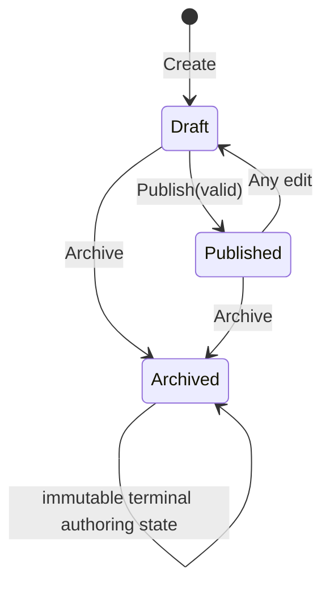
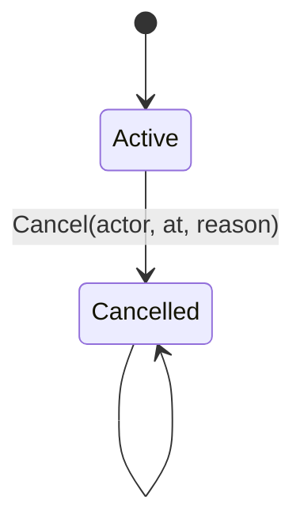
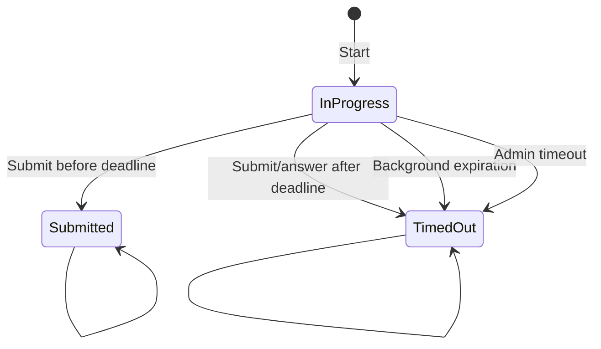

# Доменная модель TestApp

> Статус: **Implemented domain contract**. Этот документ фиксирует фактические aggregate boundaries и инварианты текущего `beta-ddd`.

## 1. Общие принципы модели

Основные агрегаты:

- `Test`;
- `PublishedTestRevision`;
- `TestAssignment`;
- `TestAttempt`.

Все основные IDs представлены strong typed wrappers над `Guid`. Для новых IDs используется `Guid.CreateVersion7()`.

Основные aggregates имеют `ConcurrencyVersion`, который изменяется при бизнес-мутации и используется EF как optimistic concurrency token.

## 2. Объекты-значения идентичности

Внутри бизнес-модели пользователи и группы представлены внешними идентификаторами:

- `ExternalUserId` — сейчас фактически Keycloak `sub`;
- `ExternalGroupId` — external group identifier/path из claims.

Domain не знает о JWT, realm, `ClaimsPrincipal` и Keycloak SDK.

### Текущее ограничение

Multi-realm identity key `(Issuer, Subject)` не реализован. Сейчас uniqueness пользователя предполагается на уровне `sub` внутри одного доверенного issuer context.

## 3. Aggregate `Test`

### 3.1 Назначение

`Test` — изменяемое рабочее определение теста.

Содержит:

- `TestId`;
- immutable `OwnerId` (`ExternalUserId` текущего автора при создании);
- `Title`;
- `TestStatus`;
- `TestSettings`;
- упорядоченная коллекция `Question`;
- aggregate `ConcurrencyVersion`;
- доменные события.

### 3.2 Lifecycle



`Archived` означает запрет дальнейшего редактирования/публикации working definition. Уже существующие published revisions не удаляются.

### 3.3 Title

- null/empty/whitespace запрещены;
- значение trim-ится;
- максимальная длина в хранилище: 300.

### 3.4 Settings

`TestSettings`:

- `PassingPercentage`: 0..100;
- default: 70;
- `TimeLimitMinutes`: `null` или > 0;
- default: `null`.

Изменение settings на `Published` переводит working test обратно в `Draft`.

### 3.5 Ownership

`Test.OwnerId` обязателен, immutable и устанавливается из current actor `sub` при создании.

- `test-author` read/write scope ограничен owned tests;
- reviewer author видит результаты только revisions собственных tests;
- `test-admin` имеет явно глобальный scope;
- владельца нельзя получить иначе, чем из `sub` вызывающего: колонка `OwnerId` обязательна и не имеет значения по умолчанию. Backfill легаси-записей значением `__legacy_admin_only__` существовал в миграциях до их схлопывания в baseline и в текущем репозитории отсутствует — вместе с самой возможностью появления такого владельца.

### 3.6 Порядок вопросов

- `Order >= 0`;
- order уникален внутри `Test`;
- reorder запрещает collision.

### 3.7 Баллы за вопрос

- `Points > 0`;
- точность в хранилище: 18,2.

### 3.8 Типы вопросов

Текущая enum:

```text
SingleChoice = 1
MultipleChoice = 2
```

Других типов в текущем домене нет.

## 4. Entity `Question`

Содержит:

- `QuestionId`;
- text;
- type;
- points;
- order;
- упорядоченные варианты ответа.

Максимальная длина текста в хранилище: 2000.

### 4.1 Инварианты варианта ответа

Для каждого option:

- text не пустой;
- text trim-ится;
- `Order >= 0`;
- order уникален внутри question;
- text уникален внутри question без учёта регистра;
- максимальная длина текста в хранилище: 2000.

### 4.2 SingleChoice

Во время authoring domain не позволяет добавить/обновить второй `IsCorrect=true`, если уже есть correct option.

Для publication требуется:

- минимум 2 options;
- ровно 1 correct option.

### 4.3 MultipleChoice

Для publication требуется:

- минимум 2 options;
- минимум 1 correct option.

## 5. Publication

`Test.Publish(occurredAt)` выполняет publication validation для всех questions.

Запрещено публиковать:

- архивный тест;
- test без вопросов;
- question с менее чем 2 options;
- SingleChoice без ровно одного correct;
- MultipleChoice без correct option.

Application дополнительно запрещает publish, если working definition уже имеет `Published` status и изменений после предыдущего publish не было.

## 6. Aggregate `PublishedTestRevision`

### 6.1 Назначение

`PublishedTestRevision` — immutable snapshot, используемый всеми assignments и attempts.

Содержит:

- `PublishedTestRevisionId`;
- parent `TestId`;
- монотонно возрастающая `Version` (>0);
- снимок названия;
- снимок порога прохождения;
- снимок ограничения по времени;
- `PublishedAt`;
- упорядоченные опубликованные вопросы и варианты;
- снимок правильности.

Уникальное ограничение в хранилище:

```text
(TestId, Version)
```

### 6.2 Почему revision immutable

Результат уже начатой/завершённой попытки не должен меняться после редактирования working `Test`.

Assignment и Attempt всегда ссылаются на `PublishedTestRevisionId`, а не на mutable `Test`.

### 6.3 Deadline

```text
DeadlineAt = StartedAt + TimeLimitMinutes
```

если `TimeLimitMinutes != null`; иначе deadline отсутствует.

### 6.4 Валидация ответа

Revision проверяет:

- question существует в snapshot;
- selected collection не пустая;
- IDs уникализируются через `Distinct()`;
- SingleChoice требует ровно один selected option;
- каждый selected option принадлежит этому question.

### 6.5 Scoring

Текущая стратегия — **exact-set scoring**.

Для каждого question:

```text
selectedSet == correctSet
    => earned += question.Points
else
    => earned += 0
```

Partial credit нет.

`Maximum` = сумма points всех revision questions.

Percentage:

```text
Maximum <= 0 ? 0 : round(Earned / Maximum * 100, 2)
```

Правило прохождения:

```text
score.Percentage >= PassingPercentage
```

## 7. Aggregate `TestAssignment`

### 7.1 Назначение

Assignment связывает immutable revision с target-аудиторией.

Содержит:

- `TestAssignmentId`;
- `RevisionId`;
- `TargetType`;
- `TargetId`;
- `AssignedBy`;
- `AssignedAt`;
- `AvailableFrom`;
- optional `AvailableUntil`;
- optional `AttemptLimit`;
- `AssignmentStatus`;
- поля аудита отмены;
- версия параллельного доступа.

### 7.2 Target

Ровно один target:

```text
User  -> ExternalUserId
Group -> ExternalGroupId
```

Persistence использует нормализованные поля:

```text
TargetType
TargetId
```

для SQL filtering/indexing.

### 7.3 Availability

Assignment доступен, если одновременно:

- `Status == Active`;
- `now >= AvailableFrom`;
- `AvailableUntil == null || now <= AvailableUntil`.

`AvailableUntil` при наличии должен быть позже `AvailableFrom`.

### 7.4 Лимит попыток

- `null` = лимита нет;
- если задан, значение > 0.

Проверка лимита при старте attempt выполняется repository-level database-safe механизмом, а не только чтением count в Application.

### 7.5 Cancellation



Для cancelled assignment запрещены изменение window/attempt limit и новый start через availability logic.

Хранятся:

- `CancelledBy`;
- `CancelledAt`;
- необязательная нормализованная причина.

## 8. Aggregate `TestAttempt`

### 8.1 Назначение

Attempt фиксирует прохождение конкретной revision конкретным пользователем по конкретному assignment.

Содержит:

- `TestAttemptId`;
- `AssignmentId`;
- `RevisionId`;
- `UserId`;
- `StartRequestId`;
- state;
- отметки времени старта, дедлайна и завершения;
- responses;
- необязательные балл и итог;
- версия параллельного доступа.

### 8.2 Lifecycle



`Submitted` и `TimedOut` — terminal states.

### 8.3 Start

Start требует:

- non-empty `StartRequestId`;
- deadline при наличии позже start;
- assignment существует;
- current actor является direct target user или входит в target group;
- assignment доступен;
- revision существует;
- attempt limit не исчерпан.

При старте создаётся response slot для каждого revision question ID.

### 8.4 Модель ответа

`QuestionResponse`:

- key = `QuestionId` внутри attempt;
- `AnsweredAt`;
- collection `SelectedAnswerOption`.

Семантика замены ответа:

- старый selected set очищается;
- записывается новый distinct set;
- `AnsweredAt` обновляется.

Очистка ответа:

- selected options очищаются;
- `AnsweredAt = null`.

### 8.5 Ownership

Ownership проверяется на Application layer:

```text
attempt.UserId == currentActor.UserId
```

для student answer/clear/submit/detail/result operations.

Admin manual timeout защищён `tests:assign` endpoint policy и не требует student ownership.

### 8.6 Обеспечение дедлайна

Есть два уровня:

1. реактивный: answer/clear/submit проверяют `DeadlineAt`;
2. proactive/background: `OverdueAttemptProcessor` сканирует expired `InProgress` attempts.

Background race с одновременным submit разрешается optimistic concurrency.

### 8.7 Completion

При completion сохраняются:

- финальный статус;
- `CompletedAt`;
- `AttemptScore`;
- `AttemptOutcome`.

Outcome:

```text
Passed
Failed
```

Timeout тоже вычисляет реальный score по сохранённым responses; он не означает автоматически 0 points.

Завершить попытку по таймауту можно двумя путями, и агрегат их различает (ADR-030):

- `Timeout(...)` — автоматический путь. Требует, чтобы deadline уже наступил, иначе `attempt.not_expired` (409). Попытку без deadline этим путём завершить нельзя.
- `ForceTimeout(...)` — ручное завершение администратором (`POST /api/v1/attempts/{id}/timeout`, `tests:assign`). Deadline не требуется; остальные инварианты (`InProgress`, `CompletedAt >= StartedAt`) сохраняются.

Оба пути дают статус `TimedOut` и событие `AttemptTimedOut` — различие видно в audit trail, а не в форме события.

## 9. Доменные события

Текущие domain events включают:

- `TestPublished`;
- `TestAssigned`;
- `TestAssignmentCancelled`;
- `AttemptStarted`;
- `AttemptSubmitted`;
- `AttemptTimedOut`.

Base `DomainEvent`:

- получает stable `EventId` (Guid v7);
- хранит `OccurredAt`;
- реализует `IDomainEvent`.

### Важная граница

`IIntegrationEvent : IDomainEvent`, но обычный `DomainEvent` не является integration event автоматически.

Следовательно, перечисленные выше domain events не должны считаться внешними contracts без отдельного явного решения.

## 10. Ownership model и её границы

Текущая single-organization модель реализована через:

```text
Test.OwnerId = Keycloak sub создавшего автора
```

Она обеспечивает resource isolation между авторами без локального User aggregate. В текущем домене намеренно отсутствуют:

- агрегат Workspace/Tenant/Team;
- модель членства и ACL;
- ключ идентичности `(Issuer, Subject)`.

Эти concepts вводятся только при реальном multi-organization/multi-realm requirement, поскольку затрагивают aggregate keys, authorization queries, idempotency, audit, events и migrations.

## 11. Не реализованные domain concepts

На текущем head отсутствуют:

- свободный текст и ручная проверка;
- числовой ответ;
- вопросы на сопоставление и упорядочивание;
- банк вопросов;
- случайные пулы вопросов;
- ограничение времени на отдельный вопрос;
- отрицательное и частичное оценивание;
- пауза и возобновление попытки;
- отложенная публикация;
- правила предварительных условий назначения;
- предварительные условия тестов и граф учебной программы;
- certificates;
- владение на уровне арендатора или команды.

Эти concepts перечислены в `FEATURE_PLAN.md` как planned/decision-required и не являются частью текущего domain contract.

### Value-object contract

Закрыто `2026-08-16` (`STAB-009`, ADR-029/ADR-030) — раздел перечислял четыре пробела, все они устранены:

- strong IDs (`TestId`, `QuestionId`, `AnswerOptionId`, `TestAssignmentId`, `TestAttemptId`, `PublishedTestRevisionId`) отвергают `Guid.Empty` в конструкторе;
- `ExternalUserId`/`ExternalGroupId` проверяют значение в конструкторе, поэтому `new` больше не обходит `FromSubject`/`FromExternalId`;
- `AttemptScore` требует `0 <= Earned <= Maximum` и `Maximum >= 0`;
- `TestAttempt.Timeout` требует наступившего deadline и отвечает `attempt.not_expired`; административное завершение живой попытки выделено в `ForceTimeout` (ADR-030).

Остаются два ограничения, которые не устраняются средствами языка и потому фиксируются здесь явно:

- `default(TId)`/`new TId()` для struct-идентификаторов недостижимо запретить — неявный parameterless конструктор структуры всегда доступен. Инвариант закрывает явные пути построения; нулевой GUID из внешнего запроса отвергается на границе транспорта (`RequestValidationFilter`, `NotEmptyGuidAttribute`) до попадания в модель.
- guard-инварианты, недостижимые при корректно сформированном caller (null Id в `Entity`, unreachable switch default, длина внешних идентификаторов), намеренно остаются исключениями — критерий отбора см. ADR-026.
