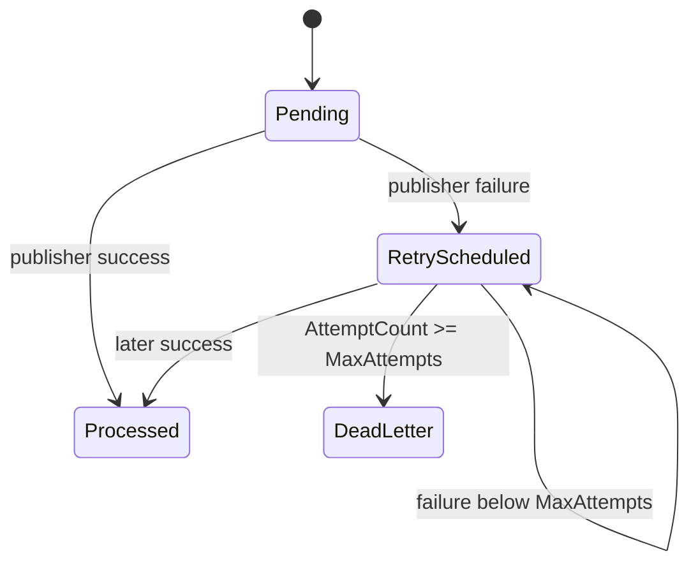

# Events, Outbox и RabbitMQ

> Статус: инфраструктура доставки **Implemented**; каталог production integration contracts — **Planned**.

## 1. Event taxonomy

В Domain определены:

```csharp
IEvent
IDomainEvent : IEvent
IIntegrationEvent : IDomainEvent
```

`IEvent` содержит:

- `EventId`;
- `OccurredAt`.

`DomainEvent` создаёт `EventId` через Guid v7 и реализует `IDomainEvent`.

## 2. Domain events

Текущие aggregates поднимают внутренние события, включая:

- `TestPublished`;
- `TestAssigned`;
- `TestAssignmentCancelled`;
- `AttemptStarted`;
- `AttemptSubmitted`;
- `AttemptTimedOut`.

Они предназначены прежде всего для фиксации факта внутри domain boundary.

### Критическое правило

`IDomainEvent` **не означает** автоматическую внешнюю публикацию.

Внешним contract считается только событие, которое явно реализует `IIntegrationEvent`.

## 3. Transactional Outbox capture

`AppDbContext.SaveChangesAsync()`:

1. собирает tracked aggregate roots;
2. читает их `DomainEvents`;
3. фильтрует `.OfType<IIntegrationEvent>()`;
4. создаёт `OutboxMessage`;
5. сохраняет бизнес-изменения и Outbox row одной MariaDB transaction;
6. после успешного `SaveChanges` очищает domain events.

Следствие:

- обычные domain events не попадают в таблицу Outbox;
- integration event не может потеряться между business commit и Outbox insert;
- publication в broker выполняется отдельно после commit.

## 4. `OutboxMessage`

Поля:

- `Id` = integration `EventId`;
- `OccurredAt`;
- `Type` = assembly-qualified event type;
- `Payload` = JSON event payload;
- `ProcessedAt`;
- `AttemptCount`;
- `LastAttemptAt`;
- `NextAttemptAt`;
- `DeadLetteredAt`;
- `Error`.

States концептуально:



## 5. Почему Outbox processor opt-in

`AddInfrastructure()` **не** регистрирует no-op publisher и не запускает delivery как будто transport существует.

Outbox processor регистрируется только при подключении реального publisher.

Это предотвращает опасную семантику:

```text
NoOp Publish -> success -> ProcessedAt set -> событие фактически потеряно
```

Если transport выключен, pending integration events должны оставаться durable backlog.

## 6. OutboxProcessor

Default options:

| Option | Default |
|---|---:|
| BatchSize | 100 |
| MaxAttempts | 10 |
| PollInterval | 5 sec |
| BaseRetryDelay | 5 sec |
| MaxRetryDelay | 15 min |
| AdvisoryLockTimeoutSeconds | 5 |

### 6.1 Batch selection

Выбираются rows:

```text
ProcessedAt == null
DeadLetteredAt == null
NextAttemptAt == null || NextAttemptAt <= now
```

Order: oldest `OccurredAt` first.

### 6.2 Multi-instance safety

Для каждого message используется MariaDB advisory lock:

```text
testapp:outbox:{messageId}
```

Через dedicated MySql connection:

```sql
SELECT GET_LOCK(...)
SELECT RELEASE_LOCK(...)
```

Это предотвращает одновременную публикацию одного row несколькими API instances.

### 6.3 Retry

После failure:

- `AttemptCount++`;
- `LastAttemptAt = now`;
- `Error = exception.Message`;
- `NextAttemptAt = exponential backoff`;
- после `MaxAttempts` -> `DeadLetteredAt`.

Backoff:

```text
BaseRetryDelay * 2^(attempt-1)
```

с cap `MaxRetryDelay`.

## 7. Delivery guarantee

Semantics: **at-least-once**.

Exactly-once не обещается.

Crash scenario:

```text
Publish to RabbitMQ succeeds
        ↓
process crashes before ProcessedAt commit
        ↓
message is published again after restart
```

Это штатно.

### Consumer requirement

Downstream consumer обязан быть идемпотентным по `EventId`/RabbitMQ `MessageId`.

## 8. RabbitMQ publisher

`RabbitMqOutboxPublisher`:

- long-lived connection;
- long-lived channel;
- publisher confirmations enabled;
- topic exchange;
- durable exchange;
- `mandatory: true`;
- persistent message;
- `MessageId = EventId`;
- `Type = eventType`;
- `ContentType = application/json`;
- `AppId = TestApp`;
- serialized publishing через `SemaphoreSlim` для одного channel;
- idempotent `DisposeAsync`.

Routing key строится из:

```text
{RoutingKeyPrefix}.{normalized-event-type}
```

Default:

```text
Exchange = testapp.events
RoutingKeyPrefix = testapp
ClientProvidedName = TestApp.Outbox
```

## 9. RabbitMQ configuration

Transport включается только при:

```text
RabbitMq:Enabled=true
```

Обязательная при enabled настройка:

```text
RabbitMq:ConnectionString=amqp://...
```

Дополнительные:

```text
RabbitMq:Exchange
RabbitMq:RoutingKeyPrefix
RabbitMq:ClientProvidedName
```

Connection string валидируется как `amqp://` или `amqps://`.

## 10. RabbitMQ readiness

Если delivery включён, `/health/ready` дополнительно:

1. открывает broker connection;
2. создаёт channel;
3. объявляет/проверяет configured durable topic exchange;
4. возвращает unhealthy при connection/auth/permission/topology error.

При disabled transport RabbitMQ не является readiness dependency.

## 11. Operational monitoring

Endpoint:

```text
GET /api/v1/operations/outbox
Policy: operations:read
```

Operational view предназначен для:

- pending count;
- retry backlog;
- dead-letter count;
- oldest pending age/time;
- последних dead-letter entries;
- error/attempt diagnostics.

Payload наружу через operational endpoint не должен раскрываться.

## 12. Текущее существенное ограничение

На текущем head transport stack полностью готов и тестируется на real RabbitMQ, но **production business integration event catalog ещё не определён**.

То есть нельзя документировать внешние события типа `test.published.v1` как существующий контракт, пока не создан отдельный event record implementing `IIntegrationEvent` и его contract tests.

Это сознательно правильнее, чем публиковать internal domain objects напрямую.

## 13. Planned integration event design

Перед первым production consumer необходимо определить versioned contracts. Предлагаемый минимальный catalog:

### EVT-001 `TestRevisionPublishedV1`

Минимальные данные:

- `EventId`;
- `OccurredAt`;
- `TestId`;
- `RevisionId`;
- `RevisionVersion`;
- actor ID при необходимости.

Не следует передавать full questions/correctness без конкретного consumer requirement.

### EVT-002 `TestAssignedV1`

- assignment ID;
- revision ID;
- target type/id;
- assignedAt.

### EVT-003 `AttemptCompletedV1`

Рекомендуется один stable external contract вместо утечки внутренних `AttemptSubmitted`/`AttemptTimedOut` details:

- attempt ID;
- assignment/revision IDs;
- user ID;
- completion type/status;
- outcome;
- score summary;
- completedAt.

### Privacy check

Перед публикацией внешних identity IDs должен быть определён data-classification/consumer boundary. Event payload не должен автоматически копировать весь aggregate.

## 14. Versioning integration events

После появления consumer schema нельзя silently менять.

Рекомендация:

```text
ContractNameV1
ContractNameV2
```

или version metadata/routing policy с явным compatibility plan.

Breaking changes требуют parallel publish/migration consumer либо согласованный cutover.

## 15. Tests, которые обязаны сопровождать transport

Текущий integration suite уже проверяет:

- publisher фактически доставляет в real RabbitMQ;
- `MessageId == EventId`;
- content type/type/persistence;
- OutboxProcessor помечает `ProcessedAt` после broker delivery;
- retry/dead-letter;
- readiness;
- publisher lifecycle/disposal.

Для каждого production integration event дополнительно требуются:

- serialization contract snapshot;
- no-sensitive-fields assertion;
- routing key assertion;
- duplicate consumer/idempotency scenario;
- compatibility test при новой версии.

## 16. Чего не следует добавлять без необходимости

- Kafka одновременно с RabbitMQ «на будущее»;
- exactly-once claims;
- event sourcing для aggregates;
- broker transaction вместо transactional Outbox;
- автоматическую публикацию каждого `IDomainEvent`;
- generic reflection-based external schema без versioned contract.