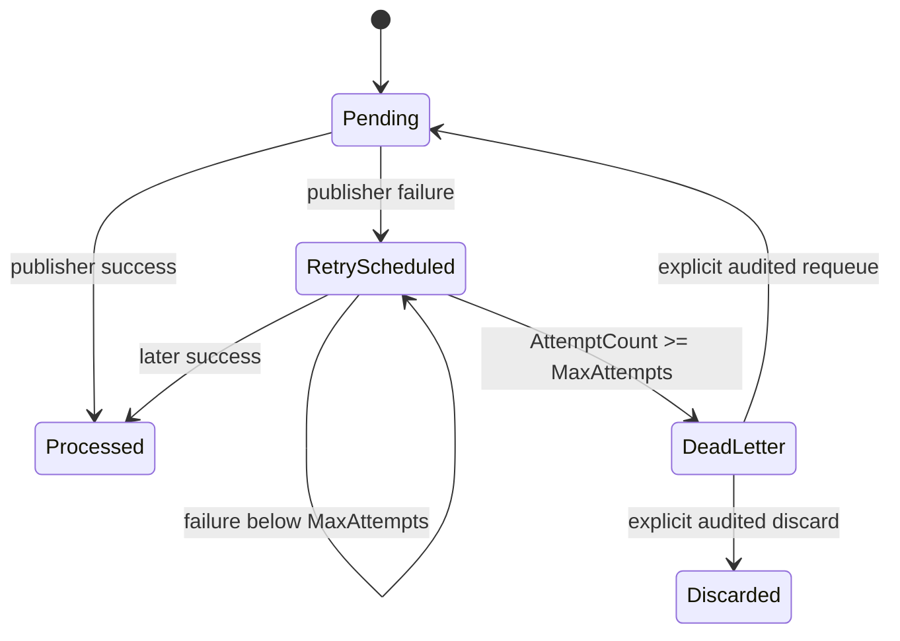

# Events, Outbox и RabbitMQ

> Статус: инфраструктура доставки **Implemented**; каталог production integration contracts — **Planned**.

## 1. Таксономия событий

В Domain определены:

```csharp
IEvent
IDomainEvent : IEvent
IIntegrationEvent : IDomainEvent
```

`IEvent` содержит:

- `EventId`;
- `OccurredAt`.

`DomainEvent` создаёт `EventId` через Guid v7 и реализует `IDomainEvent`.

## 2. Доменные события

Текущие aggregates поднимают внутренние события, включая:

- `TestPublished`;
- `TestAssigned`;
- `TestAssignmentCancelled`;
- `AttemptStarted`;
- `AttemptSubmitted`;
- `AttemptTimedOut`.

Они предназначены прежде всего для фиксации факта внутри domain boundary.

### Критическое правило

`IDomainEvent` **не означает** автоматическую внешнюю публикацию.

Внешним contract считается только событие, которое явно реализует `IIntegrationEvent`.

## 3. Захват в транзакционный Outbox

`AppDbContext.SaveChangesAsync()`:

1. собирает tracked aggregate roots;
2. читает их `DomainEvents`;
3. фильтрует `.OfType<IIntegrationEvent>()`;
4. создаёт `OutboxMessage`;
5. сохраняет бизнес-изменения и Outbox row одной PostgreSQL transaction;
6. после успешного `SaveChanges` очищает domain events.

Следствие:

- обычные domain events не попадают в таблицу Outbox;
- integration event не может потеряться между business commit и Outbox insert;
- publication в broker выполняется отдельно после commit.

## 4. `OutboxMessage`

Поля:

- `Id` = integration `EventId`;
- `OccurredAt`;
- `Type` = тип события с указанием сборки;
- `Payload` = полезная нагрузка события в JSON;
- `ProcessedAt`;
- `AttemptCount`;
- `LastAttemptAt`;
- `NextAttemptAt`;
- `DeadLetteredAt`;
- `DiscardedAt`;
- `Error`.

States концептуально:



## 5. Почему Outbox processor opt-in

`AddInfrastructure()` **не** регистрирует no-op publisher и не запускает delivery как будто transport существует.

Outbox processor регистрируется только при подключении реального publisher.

Это предотвращает опасную семантику:

```text
NoOp Publish -> success -> ProcessedAt set -> событие фактически потеряно
```

Если transport выключен, pending integration events должны оставаться durable backlog.

## 6. OutboxProcessor

Значения по умолчанию:

| Option | Default |
|---|---:|
| BatchSize | 100 |
| MaxAttempts | 10 |
| PollInterval | 5 sec |
| BaseRetryDelay | 5 sec |
| MaxRetryDelay | 15 min |
| AdvisoryLockTimeoutSeconds | 5 |

### 6.1 Выборка пакета

Выбираются rows:

```text
ProcessedAt == null
DeadLetteredAt == null
DiscardedAt == null
NextAttemptAt == null || NextAttemptAt <= now
```

Order: oldest `OccurredAt` first.

После полностью обработанного batch processor сразу выбирает следующий batch, не ожидая `PollInterval`. Это позволяет быстро дренировать накопившийся FIFO backlog. Пауза до следующего poll применяется после пустого/неполного batch либо если lock/publish failure не позволил обработать batch полностью; такое условие не создаёт tight retry loop при недоступном broker или contention.

### 6.2 Безопасность при нескольких экземплярах

Для каждого message используется session-level PostgreSQL advisory lock. Resource material:

```text
database + outbox:{messageId}
```

SHA-256 material сокращается до signed 64-bit key. Через dedicated Npgsql connection:

```sql
SELECT pg_try_advisory_lock(@key);
SELECT pg_advisory_unlock(@key);
```

Это предотвращает одновременную публикацию одного row несколькими API instances.

### 6.3 Retry

После failure:

- `AttemptCount++`;
- `LastAttemptAt = now`;
- `Error = exception.Message`;
- `NextAttemptAt` = экспоненциальная задержка;
- после `MaxAttempts` -> `DeadLetteredAt`.

Backoff:

```text
BaseRetryDelay * 2^(attempt-1)
```

с cap `MaxRetryDelay`.

### 6.4 Устойчивость воркера на уровне цикла

Per-message publish exceptions переходят в retry/dead-letter state. Exception во время batch query, advisory-lock acquisition или сохранения failure state также не выводит `OutboxProcessor` из `BackgroundService` loop: каждый poll cycle обёрнут в try/catch (`RunCycleAsync`), cycle failure логируется и worker продолжает на следующий `PeriodicTimer` tick вместо fault-а хостового process.

## 7. Гарантия доставки

Semantics: **at-least-once**.

Exactly-once не обещается.

Сценарий аварийного завершения:

```text
Publish to RabbitMQ succeeds
        ↓
process crashes before ProcessedAt commit
        ↓
message is published again after restart
```

Это штатно.

### Требование к потребителю

Downstream consumer обязан быть идемпотентным по `EventId`/RabbitMQ `MessageId`.

## 8. Публикатор RabbitMQ

`RabbitMqOutboxPublisher`:

- долгоживущее соединение;
- долгоживущий канал;
- включённые подтверждения публикации;
- обменник типа topic;
- durable-обменник;
- `mandatory: true`;
- устойчивое сообщение;
- `MessageId = EventId`;
- `Type = eventType`;
- `ContentType = application/json`;
- `AppId = TestApp`;
- serialized publishing через `SemaphoreSlim` для одного channel;
- idempotent `DisposeAsync`.

Routing key строится из:

```text
{RoutingKeyPrefix}.{normalized-event-type}
```

Default:

```text
Exchange = testapp.events
RoutingKeyPrefix = testapp
ClientProvidedName = TestApp.Outbox
```

## 9. Конфигурация RabbitMQ

Transport включается только при:

```text
RabbitMq:Enabled=true
```

Обязательная при enabled настройка:

```text
RabbitMq:ConnectionString=amqp://...
```

Дополнительные:

```text
RabbitMq:Exchange
RabbitMq:RoutingKeyPrefix
RabbitMq:ClientProvidedName
```

Connection string валидируется как `amqp://` или `amqps://`.

## 10. Готовность RabbitMQ

Если delivery включён, `/health/ready` дополнительно:

1. открывает broker connection;
2. создаёт channel;
3. объявляет/проверяет configured durable topic exchange;
4. возвращает unhealthy при connection/auth/permission/topology error.

При disabled transport RabbitMQ не является readiness dependency.

## 11. Эксплуатационный мониторинг

Endpoint:

```text
GET /api/v1/operations/outbox
Policy: operations:read
```

Operational view предназначен для:

- количество необработанных;
- очередь повторов;
- количество dead-letter;
- возраст и время самого старого необработанного;
- последних dead-letter entries;
- диагностика ошибок и попыток.

Payload наружу через operational endpoint не должен раскрываться.

Управление dead-letter:

```text
GET  /api/v1/operations/outbox/dead-letters/{eventId}
POST /api/v1/operations/outbox/dead-letters/{eventId}/requeue
POST /api/v1/operations/outbox/dead-letters/{eventId}/discard
```

- policy `operations:read` (`test-admin`);
- detail не содержит payload;
- requeue/discard требуют mandatory reason;
- action выполняется под тем же message advisory lock, что publisher;
- actor/action/reason/correlation сохраняются в `outbox_dead_letter_actions`;
- discard является terminal state, не physical delete.

## 12. Каталог 1.0: пуст намеренно

Transport stack полностью готов и тестируется на real RabbitMQ, но **на 1.0 наружу не публикуется ни одного события**: ни один production-тип не реализует `IIntegrationEvent`. Это решение, а не невыполненная работа — см. ADR-033.

Коротко: спроектированный без потребителя контракт является замороженной догадкой, а схема интеграционного события переживает свой первый релиз и меняется потом только через parallel publish или согласованный cutover (§14). Публиковать же internal domain objects напрямую запрещено ADR-012.

Состояние закреплено тестом `IntegrationEventCatalogTests`: он сверяет фактический набор реализаций `IIntegrationEvent` в production-сборках с каталогом из §13 и падает при появлении первого события. Молча добавить событие нельзя — вместе с ним обязаны обновиться §13, §14 и `CHANGELOG.md`.

Отдельным тестом удерживается предпосылка: `IIntegrationEvent` — самостоятельный маркер, а не синоним `IDomainEvent`. `AppDbContext` захватывает в Outbox только `OfType<IIntegrationEvent>()`, поэтому если бы маркер начал наследоваться всеми доменными событиями, «каталог пуст» означало бы «наружу уходит всё внутреннее».

## 13. Планируемый дизайн интеграционных событий

> Ниже — **предлагаемые** контракты, а не действующие. Действующий каталог на 1.0 пуст (§12, ADR-033). Этот раздел описывает, как контракт должен выглядеть, когда появится первый потребитель, и служит эталоном для того, кто будет его добавлять.

Перед первым production consumer необходимо определить versioned contracts. Предлагаемый минимальный catalog:

### EVT-001 `TestRevisionPublishedV1`

Минимальные данные:

- `EventId`;
- `OccurredAt`;
- `TestId`;
- `RevisionId`;
- `RevisionVersion`;
- actor ID при необходимости.

Не следует передавать full questions/correctness без конкретного consumer requirement.

### EVT-002 `TestAssignedV1`

- ID назначения;
- ID ревизии;
- тип и ID цели;
- assignedAt.

### EVT-003 `AttemptCompletedV1`

Рекомендуется один stable external contract вместо утечки внутренних `AttemptSubmitted`/`AttemptTimedOut` details:

- ID попытки;
- ID назначения и revision;
- ID пользователя;
- тип и статус завершения;
- outcome;
- сводка по баллам;
- completedAt.

### Проверка приватности

Перед публикацией внешних identity IDs должен быть определён data-classification/consumer boundary. Event payload не должен автоматически копировать весь aggregate.

## 14. Версионирование интеграционных событий

После появления consumer schema нельзя silently менять.

Рекомендация:

```text
ContractNameV1
ContractNameV2
```

или version metadata/routing policy с явным compatibility plan.

Breaking changes требуют parallel publish/migration consumer либо согласованный cutover.

## 15. Tests, которые обязаны сопровождать transport

Текущий integration suite уже проверяет:

- publisher фактически доставляет в real RabbitMQ;
- `MessageId == EventId`;
- content type, тип и устойчивость сообщения;
- OutboxProcessor помечает `ProcessedAt` после broker delivery;
- retry/dead-letter;
- readiness;
- жизненный цикл и освобождение публикатора.

Для каждого production integration event дополнительно требуются:

- снимок контракта сериализации;
- проверка отсутствия чувствительных полей;
- проверка routing key;
- сценарий дублирующего потребителя и идемпотентности;
- compatibility test при новой версии.

## 16. Чего не следует добавлять без необходимости

- Kafka одновременно с RabbitMQ «на будущее»;
- заявления о exactly-once;
- event sourcing для aggregates;
- broker transaction вместо transactional Outbox;
- автоматическую публикацию каждого `IDomainEvent`;
- generic reflection-based external schema без versioned contract.
