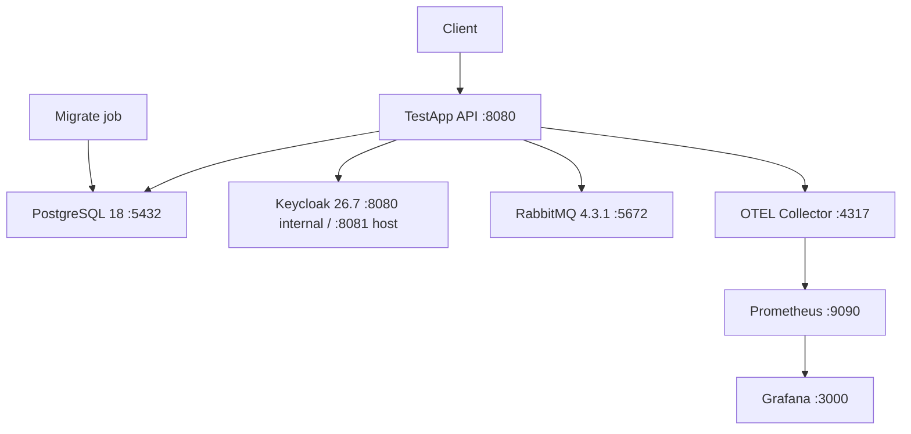

# Эксплуатация и deployment TestApp

> Статус: local/container runtime и repository operational automation D1–D6 **Implemented**; platform-specific secret store, PITR, alert routing и release rehearsal остаются deployment work.

## 1. Топология времени выполнения

Стандартный local Compose stack:



Сервисы Compose:

- `postgres`;
- `rabbitmq`;
- `keycloak`;
- `otel-collector`;
- `prometheus`;
- `grafana`;
- `migrate`;
- `api`.

## 2. Быстрый локальный старт

Перед первым запуском:

- Docker Engine или совместимая среда выполнения;
- Docker Compose версии 2.

Запуск:

```bash
docker compose up --build
```

PostgreSQL использует новый volume `testapp-postgres`. Старый MariaDB volume не удаляется автоматически. Не применяйте `docker compose down -v`, пока не подтверждены backup/cutover и допустимость удаления всех Compose volumes.

### Порты на хосте

| Service | Host |
|---|---|
| API | `http://localhost:8080` |
| Keycloak | `http://localhost:8081` |
| PostgreSQL | `localhost:5432` |
| RabbitMQ AMQP | `localhost:5672` |
| Панель управления RabbitMQ | `http://localhost:15672` |
| OTLP gRPC | `localhost:4317` |
| OTLP HTTP | `localhost:4318` |
| Prometheus | `http://localhost:9090` |
| Grafana | `http://localhost:3000` |

## 3. Учётные данные для разработки

**Только local development. Не использовать в production.**

PostgreSQL: `testapp / testapp` (локальный Compose superuser; в production application и migration roles должны быть разделены).

Grafana: `admin / admin` (`GF_SECURITY_ADMIN_USER`/`GF_SECURITY_ADMIN_PASSWORD` в `compose.yaml`).

RabbitMQ:

```text
testapp/testapp
```

Начальная учётная запись Keycloak:

```text
bootstrap-admin / bootstrap-admin
```

Пользователи dev-realm:

```text
admin   / admin   -> test-admin
author  / author  -> test-author
student / student -> group students
```

Импорт realm Keycloak:

```text
deploy/keycloak/testapp-realm.json
```

## 4. Docker-образ

`Dockerfile` — многоэтапный образ сборки и выполнения .NET.

Эксплуатационные ожидания:

- runtime process слушает configured ASP.NET port;
- container работает от non-root application user;
- тот же image используется и для API, и для migration-only mode;
- schema migration не требует отдельного tooling image.

## 5. Стратегия миграций

### 5.1 Команда режима только миграций

```bash
dotnet TestApp.Api.dll --migrate
```

В container:

```bash
docker run ... testapp-api:<tag> --migrate
```

### 5.2 Порядок запуска в локальном Compose

```text
PostgreSQL healthy
    ↓
migrate container --migrate
    ↓
migrate exits 0
    ↓
API starts
```

### 5.3 Порядок в production

Recommended:

```text
build immutable image
    ↓
backup / verify restore point
    ↓
run one migration job
    ↓
verify migration exit + schema/readiness
    ↓
roll API replicas
    ↓
post-deploy smoke tests
```

API replicas не должны одновременно применять schema migrations.

`Database:ApplyMigrationsOnStartup` в Production должен быть `false`/default false.

## 6. Каталог конфигурации

### Database

```text
ConnectionStrings:Database
Database:ApplyMigrationsOnStartup
```

Outside Development connection string обязателен; development fallback применяется только в Development. Startup migrations вне Development запрещены.

### Keycloak

```text
Keycloak:Authority
Keycloak:Audience
```

JWT metadata HTTPS required вне Development.

### RabbitMQ

```text
RabbitMq:Enabled
RabbitMq:ConnectionString
RabbitMq:Exchange
RabbitMq:RoutingKeyPrefix
RabbitMq:ClientProvidedName
```

Если `Enabled=false/absent`, Outbox delivery worker не должен зависеть от broker.

### OpenTelemetry

Стандартные env variables:

```text
OTEL_SERVICE_NAME=TestApp.Api
OTEL_EXPORTER_OTLP_ENDPOINT=http://otel-collector:4317
OTEL_EXPORTER_OTLP_PROTOCOL=grpc
```

Без `OTEL_EXPORTER_OTLP_ENDPOINT` exporter не подключается.

### Истечение попыток

Значения Infrastructure по умолчанию:

```text
BatchSize = 100
PollInterval = 30 seconds
```

Options уже загружаются/валидируются из `AttemptExpiration:BatchSize` и `AttemptExpiration:PollIntervalSeconds`.

### Доставка Outbox

Внутренние значения по умолчанию:

```text
BatchSize = 100
MaxAttempts = 10
PollInterval = 5 sec
BaseRetryDelay = 5 sec
MaxRetryDelay = 15 min
AdvisoryLockTimeoutSeconds = 5
```

Options загружаются/валидируются из секции `Outbox`. При invalid range startup завершается fail-fast.

### Композиция режима только миграций

`--migrate` загружает только `RuntimeConfiguration.LoadDatabase`; Keycloak/RabbitMQ/worker/CORS/rate-limit/OpenAPI/reverse-proxy configuration не загружается и соответствующие DI-регистрации пропускаются. Migration job/container может получать только `ConnectionStrings:Database` (и опционально `Database:ApplyMigrationsOnStartup`) без остальных runtime secrets/config — см. `compose.yaml` сервис `migrate`.

## 7. Health-эндпоинты

### Liveness

```text
GET /health/live
```

Назначение: процесс способен отвечать. Не должен зависеть от PostgreSQL/RabbitMQ, иначе transient dependency failure может вызвать restart loop.

### Readiness

```text
GET /health/ready
```

Проверяет:

- доступность PostgreSQL;
- RabbitMQ connection/channel/exchange access, **только если RabbitMQ delivery включён**.

При critical dependency failure readiness должна вернуть unhealthy/503 и исключить instance из traffic.

## 8. OpenTelemetry

Текущая instrumentation:

- запросы ASP.NET Core;
- исходящие запросы HttpClient;
- метрики среды выполнения .NET.

Health endpoints исключаются из request traces, чтобы probes не создавали telemetry noise.

Конфигурация локального коллектора:

```text
deploy/otel-collector-config.yaml
```

Collector пишет traces только в `debug` exporter (нет configured traces backend). Metrics пишутся в `debug` **и** `prometheus` exporter (`0.0.0.0:8889`), который Compose-сервис `prometheus` scrape'ит как target `testapp` (`deploy/prometheus/prometheus.yml`). Prometheus также загружает alert rules из `deploy/prometheus/alerts.yml`, реализующие пороги `docs/SLO_ALERTS.md` §4. Grafana подключена к Prometheus как provisioned datasource (`deploy/grafana/provisioning`) и показывает dashboard `TestApp Overview` (`deploy/grafana/dashboards/testapp-overview.json`), реализующий "dashboard minimum" из `docs/SLO_ALERTS.md` §6. См. ADR-027 в `docs/DECISIONS.md` за обоснованием выбора Prometheus/Grafana вместо Jaeger.

`scripts/validate-observability-stack.sh` (запускается CI workflow `observability`) проверяет: `promtool check config/rules`, здоровье Prometheus targets, наличие ожидаемых metric families, здоровье Grafana datasource и присутствие dashboard.

### Известные ограничения

- Alert rules оцениваются **только внутри Prometheus** (видны на вкладке Alerts в Prometheus/Grafana UI). Alertmanager и маршрутизация в pager/chat не настроены — это отдельный deployment-owned шаг (`docs/SLO_ALERTS.md` §7, `docs/ROADMAP.md` Phase E item 12).
- Нет активного HTTP-пробинга `/health/ready` (например, `blackbox_exporter`) — правило `TestAppMetricsPipelineDown` проверяет только доступность OTel Collector metrics endpoint, а не реальную readiness API.
- Трейсы (`traces` pipeline) по-прежнему уходят только в `debug` exporter — выбор backend для трейсинга (Tempo/Jaeger/другой) остаётся открытым и не обязателен, пока нет измеренной потребности в distributed tracing (см. ADR-027).

## 9. Структурированная телеметрия запросов

`RequestTelemetryMiddleware` логирует:

- HTTP-метод;
- path;
- код статуса;
- длительность в мс;
- идентификатор трассировки и корреляции.

Не следует добавлять в request logs raw access token, passwords, correct-answer payload или arbitrary body.

## 10. Correlation

`X-Correlation-ID`:

- принимается от клиента при валидной длине;
- генерируется при отсутствии;
- возвращается в response;
- используется как `TraceIdentifier`;
- попадает в audit.

При инциденте основной join key:

```text
client correlation ID
    ↔ HTTP log
    ↔ audit_entries.CorrelationId
    ↔ trace ID
```

## 11. Операции аудита

Endpoint:

```text
GET /api/v1/operations/audit
role: test-admin
```

Filters:

- actorId;
- statusCode;
- from;
- to;
- page/pageSize.

Audit записывается для:

- POST;
- PUT;
- PATCH;
- DELETE.

Audit не содержит body/query payload.

### Retention

Repository-level bounded cleanup реализован для audit, idempotency и processed Outbox rows:

- типизированные сроки хранения, размер пакета и интервал опроса;
- PostgreSQL advisory lock между replicas;
- ограниченные удаления, дружественные к индексам;
- pending/retrying/active dead-letter Outbox rows не удаляются;
- deleted-row counters экспортируются через `TestApp.Operations`.

Deployment owner всё ещё определяет фактические retention periods, archival/export и необходимость immutable/WORM external audit sink.

### Контракт статуса аудита

Audit/correlation middleware оборачивает exception mapping и сохраняет финальный HTTP status. Regression coverage подтверждает равенство response/audit для handled `400/409`, precondition `412` и real `500`. При incident triage correlation ID остаётся ключом сопоставления audit, HTTP log и trace.

## 12. Операции Outbox

Endpoint:

```text
GET /api/v1/operations/outbox
role: test-admin
```

Использовать для проверки:

- растущая очередь необработанных;
- рост числа повторов;
- количество dead-letter;
- возраст самого старого необработанного;
- повторяющаяся причина ошибки.

### Runbook: Outbox backlog растёт

1. Проверить `/health/ready`.
2. Проверить `RabbitMq:Enabled` и broker DNS/network/auth.
3. Проверить RabbitMQ exchange/permissions.
4. Проверить application logs по OutboxMessageId.
5. Проверить dead-letter state.
6. Не удалять rows вручную до выяснения причины.
7. После восстановления transport processor автоматически продолжит due retries.

### Runbook: сообщение в dead-letter

1. Зафиксировать message ID/type/error/attempt count.
2. Проверить, временная это ошибка или permanent schema/routing issue.
3. Исправить consumer/broker/config/application.
4. Получить safe detail без payload: `GET /api/v1/operations/outbox/dead-letters/{eventId}`.
5. После устранения причины выполнить audited `POST .../{eventId}/requeue` с mandatory reason.
6. Если message доказанно устарел, выполнить audited `POST .../{eventId}/discard`; это terminal state, не physical delete.
7. Не редактировать payload и delivery columns вручную.

## 13. Операции истечения попыток

`OverdueAttemptProcessor` работает внутри API process.

### Если expired attempts остаются InProgress

Проверить:

- application instance жив;
- логи запуска воркера;
- доступность БД;
- отметки времени дедлайнов;
- конфликты параллельного доступа;
- error logs по AttemptId.

Worker batch-based и eventual: изменение не обязано произойти ровно в момент deadline; default scan cadence около 30 секунд.

### Восстановление воркера на уровне цикла

Per-attempt processing exceptions логируются; initial/batch DB scan также покрыт cycle-level recovery boundary (`RunCycleAsync`) — как у expiration worker, так и у Outbox batch query/lock/failure-state persistence. Transient dependency failure логируется и worker продолжает на следующий poll tick вместо завершения hosted worker/process.

## 14. Эксплуатационная политика PostgreSQL 18

CI выполняет `SHOW server_version_num` и гарантирует PostgreSQL 18+ (`>= 180000`).

### Правило обновления

Перед изменением PostgreSQL line:

1. backup;
2. проверить vendor upgrade path;
3. поднять isolated copy;
4. прогнать migrations;
5. прогнать полный integration suite;
6. проверить advisory locks;
7. проверить locale/collation/extensions/indexes;
8. выполнить production-image `--migrate`;
9. только после этого менять production.

Нельзя считать смену Docker tag достаточным production upgrade process.

## 15. Backup/restore/DR

Repository baseline реализован:

- `scripts/postgresql-backup.sh` создаёт consistent custom-format archive + SHA-256;
- `scripts/postgresql-restore-verify.sh` восстанавливает только в disposable target database;
- проверяются table counts, EF migration history и optional business marker;
- основной CI выполняет recovery drill после migration production image;
- инженерные цели: RPO <= 24 ч, RTO <= 4 ч.

До production deployment необходимо:

- настроить schedule, encrypted offsite storage и retention;
- выполнить staging/platform restore drill и записать actual RTO;
- для более строгого RPO включить provider-native snapshot/WAL/PITR;
- определить credential/Keycloak realm restore и rotation;
- уметь пересоздать RabbitMQ topology; broker не является единственным source of truth благодаря Outbox.

Полный runbook: `BACKUP_RESTORE.md`.

### Проверка производительности D6

PostgreSQL baseline подтверждён полным green run на implementation commit `9916b98`. Artifact содержит 8771/8771 successful checks, HTTP failure rate 0, expiration drain 1247 -> 0 за 14 s и Outbox drain 100 -> 0 за 1 s. RabbitMQ probe использует поддерживаемую 4.3 durable queue topology в одноразовом CI volume.

## 16. Чек-лист дымового прогона после развёртывания

После rollout:

```text
/health/live -> 200
/health/ready -> healthy
/openapi/v1.json -> согласно production policy
JWT auth -> работает
GET /api/v1/me/assignments -> expected auth behavior
PostgreSQL version -> expected
migration history -> no pending migrations
Outbox status -> no unexpected backlog
OTEL -> traces/metrics arrive
```

Для migration release дополнительно выполнить representative create/publish/assign/start/submit flow в staging.

## 16.0 Staging-контур

Контур гейта 1.0 (issue #16, ADR-031). Одна VM, `compose.staging.yaml`, наружу опубликован только ingress.

### Что нужно от машины

4 vCPU / 8 ГБ — разумный минимум для девяти контейнеров, из которых Keycloak на JVM, Prometheus и Grafana — основные потребители памяти. Это оценка; фактическую цифру даст `#20`.

**k6 запускать с другой машины.** Генератор нагрузки на том же хосте конкурирует за CPU с системой под тестом, и `p95` измерит борьбу за планировщик, а не ёмкость.

### Развёртывание

```bash
git clone <repo> && cd TestApp
cp .env.staging.example .env && chmod 600 .env    # заполнить, пароли генерировать: openssl rand -base64 32
docker compose -f compose.staging.yaml --env-file .env up -d
```

`TESTAPP_IMAGE` задаётся **digest'ом** из тела GitHub Release, не тегом. `TESTAPP_INTERNAL_CIDR` узнаётся после первого запуска:

```bash
docker network inspect testapp-staging_default -f '{{(index .IPAM.Config 0).Subnet}}'
```

### Обязательная проверка после первого запуска

Лимит частоты ключуется по claim `sub`, а для анонимных запросов — по `RemoteIpAddress`, при этом `ForwardedHeaders` доверяет только объявленным сетям. Если `ReverseProxy:KnownNetworks` задан неверно, весь анонимный трафик схлопнется в одну партицию по адресу ingress: `#20` упрётся в `429`, не связанные с ёмкостью, а `#19` откалибрует по этим цифрам пороги. Обе ошибки выглядят как настоящие измерения.

Проверить до первого нагрузочного прогона — в audit trail должны быть **клиентские** адреса, а не адрес ingress:

```bash
curl -s -H "Authorization: Bearer $ADMIN_TOKEN" \
  "https://$TESTAPP_PUBLIC_HOST/api/v1/operations/audit?page=1&pageSize=5"
```

### Фикстурные пользователи

Realm `testapp-staging` импортируется **без пользователей** — в репозитории не лежит ни одного действующего креденшела контура. Автора, администратора и студента заводит оператор вручную в консоли Keycloak (`/auth`), с ролями `test-author`, `test-admin` и группой `students` соответственно, паролями из `.env`. Клиент `testapp-api` — confidential; его секрет нужен k6 и Postman.

### Проверка готовности

```text
GET https://<host>/health/live                    -> 200
GET https://<host>/health/ready                   -> healthy
GET https://<host>/api/v1/operations/version      -> версия и digest совпадают с развёрнутым
дашборд TestApp Overview в /grafana               -> живой трафик
```

Развёрнутый digest записать — он потребуется для отката в `#23`.

## 16.0.1 Первый подъём контура

Одноразовая процедура. Отличается от штатного развёртывания (§16.0) тем, что образа в GHCR ещё нет, `.env` не заполнен, а realm импортируется впервые. Дальнейшие развёртывания — §16.0 и §16.2.

Выполнять по порядку: каждый шаг проверяем прежде, чем идти дальше. Отказ на пятом шаге, вызванный ошибкой на втором, диагностируется втрое дольше.

### Шаг 1. Образ в GHCR

Штатно `TESTAPP_IMAGE` берётся digest'ом из тела GitHub Release, но ни одного релиза ещё нет. Есть два пути; **рекомендуется первый**.

**Через `release` workflow на временном теге.** Заодно это первый реальный прогон `release.yml`, который до сих пор проверялся только синтаксически — лучше узнать о его проблемах здесь, чем при выпуске RC.

```bash
git tag v1.0.0-preflight.1 <коммит>
git push origin v1.0.0-preflight.1
```

Тег обязан начинаться с `v` и согласовываться с `VersionPrefix` из `Directory.Build.props` — workflow это проверяет и падает при расхождении. Суффикс `preflight`, а не `rc`, чтобы не занимать имя первого кандидата.

Digest берётся из тела созданного Release, строка «Развернуть по digest».

**Вручную**, если workflow недоступен:

```bash
docker build -t ghcr.io/hhypest/testapp:preflight .
docker push ghcr.io/hhypest/testapp:preflight
docker inspect --format='{{index .RepoDigests 0}}' ghcr.io/hhypest/testapp:preflight
```

Имя образа **в нижнем регистре** — Docker не принимает заглавные в имени репозитория, хотя сам репозиторий называется `hhypest/TestApp`.

### Шаг 2. Доступ к GHCR с машины контура

Пакет приватного репозитория по умолчанию приватный, поэтому анонимный `docker pull` вернёт `denied`. Нужен PAT с областью `read:packages`:

```bash
echo "$GHCR_TOKEN" | docker login ghcr.io -u <github-логин> --password-stdin
docker pull ghcr.io/hhypest/testapp@sha256:<digest>    # проверка доступа до подъёма стека
```

Если `pull` не проходит — дальше идти бессмысленно: контейнеры `migrate` и `api` не стартуют.

### Шаг 3. Окружение

```bash
git clone <repo> && cd TestApp
cp .env.staging.example .env && chmod 600 .env
```

Заполнить. Пароли **генерировать**, а не придумывать: `openssl rand -base64 32`. `TESTAPP_IMAGE` и `TESTAPP_IMAGE_DIGEST` — из шага 1; первый в форме `образ@sha256:...`, второй — только `sha256:...`.

`TESTAPP_INTERNAL_CIDR` на этом шаге ещё неизвестен: сети не существует, пока стек не поднят. Оставить значение из шаблона, исправить на шаге 5.

DNS-запись домена из `TESTAPP_PUBLIC_HOST` должна указывать на машину **до** первого запуска: Caddy запрашивает сертификат при старте, и без резолва получит отказ, а Let's Encrypt ограничивает частоту повторов.

### Шаг 4. Первый запуск

```bash
docker compose -f compose.staging.yaml --env-file .env up -d
docker compose -f compose.staging.yaml --env-file .env ps
```

Порядок гарантирован `depends_on`: PostgreSQL → init-скрипт создаёт базу Keycloak → `migrate` отрабатывает и завершается → стартует `api`.

Проверить, что миграции применились и контейнер завершился успешно, а не молча упал:

```bash
docker compose -f compose.staging.yaml --env-file .env logs migrate | tail -20
```

Ожидаемо: `migrate` в состоянии `exited (0)`. Ненулевой код — читать логи, API всё равно не поднимется.

### Шаг 5. Доверенная сеть — до любых измерений

Узнать фактический CIDR и вписать его в `.env`:

```bash
docker network inspect testapp-staging_default -f '{{(index .IPAM.Config 0).Subnet}}'
```

Если значение отличается от того, что в `.env`, — исправить и перезапустить API:

```bash
docker compose -f compose.staging.yaml --env-file .env up -d --force-recreate api
```

**Почему это нельзя отложить.** Лимит частоты ключуется по claim `sub`, а для анонимных запросов — по `RemoteIpAddress`; `ForwardedHeaders` доверяет только объявленным сетям. При неверном CIDR весь анонимный трафик схлопнется в одну партицию по адресу ingress. Нагрузочный прогон `#20` упрётся в `429`, не связанные с ёмкостью, эти цифры уйдут в `PERFORMANCE.md` как baseline 1.0, а по ним откалибруются пороги алертов `#19`. Обе ошибки будут выглядеть как настоящие измерения.

### Шаг 6. Пользователи realm

Realm `testapp-staging` импортируется **без пользователей**. Завести вручную в консоли Keycloak (`https://<host>/auth`, вход по `KEYCLOAK_ADMIN_USER`):

| Пользователь | Роль realm | Группа |
|---|---|---|
| автор | `test-author` | — |
| администратор | `test-admin` | — |
| студент | — | `students` |

Пароли — те, что записаны в `.env` (`AUTHOR_PASSWORD` и остальные): их читают k6 и Postman.

### Шаг 7. Проверка

```bash
curl -sf https://<host>/health/live                 # 200
curl -sf https://<host>/health/ready                # healthy
```

Токен и версия:

```bash
TOKEN=$(curl -s -X POST "https://<host>/auth/realms/testapp-staging/protocol/openid-connect/token" \
  -d client_id=testapp-api -d client_secret="$TESTAPP_KEYCLOAK_CLIENT_SECRET" \
  -d grant_type=password -d username="$ADMIN_USERNAME" -d password="$ADMIN_PASSWORD" \
  | python3 -c 'import sys,json;print(json.load(sys.stdin)["access_token"])')

curl -s -H "Authorization: Bearer $TOKEN" https://<host>/api/v1/operations/version
```

Ответ обязан содержать версию и **тот самый digest**, который развёрнут. Расхождение означает, что `TESTAPP_IMAGE_DIGEST` не соответствует `TESTAPP_IMAGE` — до исправления откат в `#23` будет выполняться вслепую.

Затем — проверка доверенной сети из шага 5:

```bash
curl -s -H "Authorization: Bearer $TOKEN" "https://<host>/api/v1/operations/audit?page=1&pageSize=5"
```

В записях должны быть **клиентские** адреса, а не адрес контейнера ingress.

Наконец, дашборд `TestApp Overview` в `https://<host>/grafana` должен показывать живой трафик — значит цепочка API → OTel Collector → Prometheus → Grafana собрана.

### Шаг 8. Зафиксировать

Записать в `#16`: развёрнутый digest, фактический CIDR, дату подъёма и владельца машины. Digest потребуется для отката в `#23`, CIDR — при пересоздании сети.

### Если что-то пошло не так

| Симптом | Наиболее вероятная причина |
|---|---|
| `denied` при старте `migrate`/`api` | нет `docker login ghcr.io` (шаг 2) или образ приватный |
| Caddy не получает сертификат | DNS не резолвится в машину, либо порт 80 закрыт фаерволом |
| Keycloak падает на старте | база из `KEYCLOAK_DB` не создана — том инициализировался до появления init-скрипта; пересоздать том |
| `401` на любой запрос с валидным токеном | `Keycloak__Authority` не совпадает с issuer токена; сверить `KC_HOSTNAME` и путь `/auth` |
| `429` в спокойном режиме | неверный `TESTAPP_INTERNAL_CIDR` (шаг 5) |
| `/operations/version` отдаёт `imageDigest: null` | `TESTAPP_IMAGE_DIGEST` не задан в `.env` |

## 16.0.2 Минимум для внутреннего пилота

Гейт 1.0 открыт по семи пунктам, и это осознанно: контур поднимается раньше, чем гейт пройден. Но два сценария отказа нельзя оставлять открытыми даже для внутреннего пилота, потому что цена у них — необратимая.

| Сценарий | Чем закрыт |
|---|---|
| Авария, о которой никто не узнал | Alertmanager в `compose.staging.yaml` |
| Данные, которые нельзя вернуть | `scripts/backup-offsite.sh` по расписанию |

Оба закрывают **доставку**, а не проверку. Полный объём `#18` (восстановление с измеренным RTO) и `#19` (три drill'а с калибровкой порогов) остаётся открытым: наличие копии в хранилище не означает, что из неё можно восстановиться, а доставка алерта не означает, что порог выбран верно.

### Куда уходят алерты

URL webhook'а — секрет: у Slack и Mattermost он даёт право писать в канал. Поэтому он не в конфиге, а в отдельном файле, который создаёт оператор:

```bash
printf '%s' 'https://hooks.example.org/services/...' > deploy/staging/webhook-url
chmod 600 deploy/staging/webhook-url
```

Файл в `.gitignore`. Без него Alertmanager **не стартует** — и это правильно: молчащий приёмник хуже явного отказа, по той же причине, по которой ADR-014 запрещает no-op publisher как success path.

Маршрутизация разбирает алерты по метке `severity`, которую проставляют правила: `page` ждёт 10 секунд и повторяется раз в час, `warning` — 30 секунд и раз в четыре часа. Пока горит `page`, `warning` того же алерта подавляется.

Проверить доставку до того, как понадобится:

```bash
docker compose -f compose.staging.yaml --env-file .env exec alertmanager \
  amtool alert add TestDelivery severity=page --alertmanager.url=http://localhost:9093
```

Сообщение обязано прийти в канал. Если не пришло — разбираться сейчас, а не в момент аварии.

### Бэкапы с машины

Локальный том рядом с базой не переживёт отказ диска, поэтому копия обязана уехать. `scripts/backup-offsite.sh` снимает дамп, шифрует его **до** выгрузки и отправляет командой, которую задаёт развёртывание:

```bash
BACKUP_AGE_RECIPIENT=age1... \
BACKUP_UPLOAD_CMD='rclone copyto {} remote:testapp-backups/' \
POSTGRES_DOCKER_NETWORK=testapp-staging_default \
POSTGRES_HOST=postgres POSTGRES_PASSWORD=... \
  bash scripts/backup-offsite.sh
```

`POSTGRES_DOCKER_NETWORK` обязателен: на контуре порт PostgreSQL наружу не публикуется, поэтому `pg_dump` запускается в сети compose, а не в сети хоста. По умолчанию скрипты используют `host` — так работает CI, где база опубликована на `127.0.0.1`.

По расписанию, ежедневно ночью:

```cron
17 3 * * * cd /opt/TestApp && BACKUP_AGE_RECIPIENT=age1... BACKUP_UPLOAD_CMD='...' POSTGRES_DOCKER_NETWORK=testapp-staging_default POSTGRES_HOST=postgres POSTGRES_PASSWORD=... bash scripts/backup-offsite.sh >> /var/log/testapp-backup.log 2>&1
```

Ключ age, которым шифруются копии, хранить **не на этой машине**: копия, расшифровываемая только тем диском, который вы потеряли, бесполезна.

### Чего это не даёт

RPO остаётся суточным: между ночными выгрузками изменения существуют в одном экземпляре. Для внутреннего пилота это приемлемо, если участники предупреждены; для внешних пользователей нужен WAL-архив, и `docs/BACKUP_RESTORE.md` §1 прямо относит это к ответственности развёртывания.

Восстановление ни разу не выполнялось на реальном объёме — это `#18`. До его закрытия считать, что бэкапы работают, нельзя: можно считать только, что они снимаются.

## 16.1 Сбор доказательств CI для релиза

Гейт 1.0 (`docs/ROADMAP.md` §7, пункт 7) требует зелёных пайплайнов на релизном коммите, а критерий готовности RC (issue #23) — записанных run ID. Триггеры устроены так, что «прогон не запускался» и «прогон прошёл» выглядят в интерфейсе одинаково, поэтому собирать нужно именно ID, а не отсутствие красного.

| Workflow | На push в `beta-ddd`/`master` | На тег `v*` | Ручной запуск |
|---|---|---|---|
| `dotnet` | всегда | да | `workflow_dispatch` |
| `security` | всегда | да | `workflow_dispatch` |
| `observability` | по paths-фильтру | **нет** | `workflow_dispatch` |
| `performance` | по paths-фильтру | **нет** | `workflow_dispatch` |
| `postman` | по paths-фильтру | **нет** | `workflow_dispatch` |

Три нижних workflow ограничены `paths`, а релизный коммит меняет только `CHANGELOG.md` — под фильтр он не попадает. Добавлять им триггер на тег бессмысленно: `paths` применяется и к push тега, и результат непредсказуем. Поэтому для них предусмотрен ручной запуск.

Порядок сбора доказательств:

1. Запушить релизный коммит в `beta-ddd`. `dotnet` и `security` стартуют сами.
2. Запустить `observability`, `performance` и `postman` вручную (`Actions` → workflow → `Run workflow`) — на той же ветке либо, если тег уже поставлен, прямо на теге: `workflow_dispatch` принимает тег как ref. Убедиться, что в запуске выбран ровно тот коммит, который станет (или уже стал) головой тега.
3. Поставить тег `v1.0.0-rc.N` на этот коммит. `dotnet` и `security` отработают ещё раз, уже от тега.
4. Таблицу run ID собирает сам workflow `release`: он запрашивает у API все прогоны с `head_sha` релизного коммита и вписывает их в тело Release вместе с SBOM и digest. Переносить номера руками не нужно и не следует.

Порядок шагов 2 и 3 важен: `release` видит только те прогоны, которые существуют на момент выпуска. Если пайплайн запущен после создания Release, таблица устареет — тогда нужно перезапустить `release` вручную с включённым `evidence_only`. В этом режиме образ не пересобирается (иначе у того же тега появился бы новый digest, и Release стал бы называть не то, что развёрнуто): читается digest уже опубликованного образа, таблица собирается заново, тело Release обновляется, приложенные файлы не трогаются.

Запускать такой прогон следует **с ветки, а не с тега**: `workflow_dispatch` берёт определение workflow из того ref, с которого запущен, поэтому тег со старой версией `release.yml` про `evidence_only` не знает. Ветка задаёт, *чем* выпускать; поле `tag` — *что* выпускать. Код и коммит для доказательств берутся из тега, а не из ветки.

Проверка перед объявлением RC: пять пайплайнов присутствуют в таблице, у каждого заключение `success`. Строка «не запускался» — это не эквивалент успешного прогона, а `in_progress` означает, что сверку нужно повторить после завершения.

## 16.2 Выпуск релиза

### Единый источник версии

`Directory.Build.props` в корне репозитория задаёт `VersionPrefix`. Суффикс предрелиза передаёт релизный пайплайн:

```bash
dotnet publish -p:VersionSuffix=rc.1     # -> 1.0.0-rc.1
```

Dockerfile принимает это как `--build-arg VERSION_SUFFIX`. До появления `Directory.Build.props` версии не было нигде: сборки получали неявный `1.0.0`, поэтому по развёрнутому образу нельзя было сказать, что именно в нём.

Что развёрнуто, спрашивается у самого процесса:

```http
GET /api/v1/operations/version
Authorization: operations:read
```

```json
{ "version": "1.0.0-rc.1", "imageDigest": "sha256:…" }
```

`version` читается из атрибута сборки, а не из константы — константу легко забыть поднять, и тогда контур будет уверенно называть неверную версию. `imageDigest` приходит из переменной окружения `TESTAPP_IMAGE_DIGEST`, которую обязано проставить развёртывание; без неё поле равно `null`.

### Политика тегов

```text
v1.0.0-rc.N   режется из beta-ddd
v1.0.0        режется после merge в master
```

Тег обязан согласовываться с `VersionPrefix`: релизный workflow сверяет их и падает при расхождении. Поднимать `VersionPrefix` следует в том же change set, что и тег.

После первого RC ветка `beta-ddd` заморожена для feature-изменений и принимает только fix-коммиты, каждый с regression-тестом.

### Порядок выпуска

1. Собрать доказательства CI по §16.1 — пять run ID на релизном коммите.
2. Поставить тег на этот коммит. Запускается workflow `release`: сборка образа, публикация в GHCR, SBOM, GitHub Release.
3. Сверить таблицу пайплайнов в теле Release: она собрана из API, но зелёным её объявляет человек. Если чего-то не хватает — доснять по §16.1 и перезапустить `release` с `evidence_only`.
4. Разворачивать **по digest, а не по тегу**: тег перемещаем, digest — нет. Digest указан в теле Release и обязан быть проброшен в `TESTAPP_IMAGE_DIGEST`.

### Что приложено к Release

| Файл | Что это |
|---|---|
| `testapp-api-<версия>.image.tar.gz` | сам образ, загружаемый `docker load` без доступа к реестру |
| `testapp-api.cdx.json` | SBOM образа (CycloneDX) |
| `openapi-v1.json` | замороженный контракт v1 на момент выпуска |

Образ приложен по той же причине, что и SBOM: GHCR может стать недоступен, пакет — приватным, а машина, на которую разворачивают, — отрезанной от интернета. Release остаётся самодостаточным.

### Офлайн-установка из архива

```bash
sha256sum -c <<< "<SHA-256 из тела Release>  testapp-api-<версия>.image.tar.gz"
docker load -i testapp-api-<версия>.image.tar.gz
```

Штатный путь этим не отменяется: канонической ссылкой на сборку остаётся digest в GHCR. У архива своя особенность — после `docker load` образ доступен под тегом, но **без** digest: RepoDigest присваивает реестр, а не архив, поэтому `TESTAPP_IMAGE` на такой машине задаётся тегом. Роль доказательства подлинности берёт на себя SHA-256 архива, записанный в теле Release и проверенный до загрузки. `TESTAPP_IMAGE_DIGEST` при этом всё равно выставляется в digest из Release: он не участвует в получении образа, а отвечает на вопрос «что запущено» через `GET /api/v1/operations/version`.

Контрольная сумма считается от файла, а не от манифеста, сознательно: `docker save`/`docker load` сохраняет содержимое образа, но представление метаданных зависит от того, какое хранилище образов использует демон (классическое или containerd), и сравнение digest'ов между разными машинами перестаёт быть надёжным. Сумма файла не зависит ни от чего.

Workflow `release` не является гейтом качества: он ничего не проверяет и не запускает тесты. Гейт — пять существующих пайплайнов на том же коммите.

## 17. Модель масштабирования

API можно горизонтально масштабировать при общей PostgreSQL/RabbitMQ/Keycloak инфраструктуре.

Cross-instance safety уже предусмотрена для:

- оптимистичный параллельный доступ к агрегатам;
- небезопасные идемпотентные операции;
- обработка сообщений Outbox.

Background attempt expiration может выполняться на нескольких replicas: optimistic concurrency делает duplicate attempt completion безопасным, хотя при большом scale можно позже выделить dedicated worker role.

## 18. Когда выделять worker process

Отдельный worker deployment целесообразен, если:

- Outbox/expiration создают заметную нагрузку на API replicas;
- требуется независимый scaling;
- нужны разные resource limits;
- operational isolation становится важнее простоты монолита.

До этого hosted services внутри modular monolith достаточны.

## 19. Пробелы готовности к production

До production 1.0 закрыть:

- staging backup/restore drill с measured RTO;
- deployed secret manager/injection и encrypted backup schedule/PITR policy;
- реальные dashboard/alert routes и alert drill;
- immutable dependency/action/image pinning и более узкий secret-scan allowlist;
- задокументированная репетиция релиза с откатом и исправлением вперёд.

Trusted proxies, CORS/TLS/HSTS configuration contract, configurable rate limiting, repository retention, dead-letter API, security/image scan и SBOM уже реализованы и не должны оставаться в списке отсутствующих возможностей.
