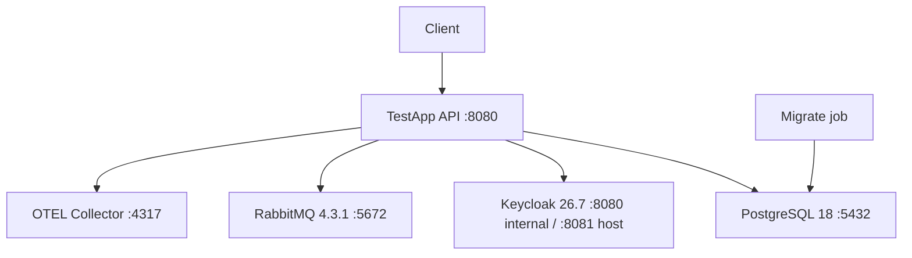

# Эксплуатация и deployment TestApp

> Статус: local/container runtime и repository operational automation D1–D5 **Implemented**; D6 **Verifying**; platform-specific secret store, PITR, alert routing и release rehearsal остаются deployment work.

## 1. Runtime topology

Стандартный local Compose stack:



Compose services:

- `postgres`;
- `rabbitmq`;
- `keycloak`;
- `otel-collector`;
- `migrate`;
- `api`.

## 2. Local quick start

Перед первым запуском:

- Docker Engine/compatible runtime;
- Docker Compose v2.

Запуск:

```bash
docker compose up --build
```

PostgreSQL использует новый volume `testapp-postgres`. Старый MariaDB volume не удаляется автоматически. Не применяйте `docker compose down -v`, пока не подтверждены backup/cutover и допустимость удаления всех Compose volumes.

### Host ports

| Service | Host |
|---|---|
| API | `http://localhost:8080` |
| Keycloak | `http://localhost:8081` |
| PostgreSQL | `localhost:5432` |
| RabbitMQ AMQP | `localhost:5672` |
| RabbitMQ management | `http://localhost:15672` |
| OTLP gRPC | `localhost:4317` |
| OTLP HTTP | `localhost:4318` |

## 3. Development credentials

**Только local development. Не использовать в production.**

PostgreSQL: `testapp / testapp` (локальный Compose superuser; в production application и migration roles должны быть разделены).

RabbitMQ:

```text
testapp/testapp
```

Keycloak bootstrap:

```text
bootstrap-admin / bootstrap-admin
```

Dev realm users:

```text
admin   / admin   -> test-admin
author  / author  -> test-author
student / student -> group students
```

Keycloak realm import:

```text
deploy/keycloak/testapp-realm.json
```

## 4. Docker image

`Dockerfile` — multi-stage .NET build/runtime image.

Operational expectations:

- runtime process слушает configured ASP.NET port;
- container работает от non-root application user;
- тот же image используется и для API, и для migration-only mode;
- schema migration не требует отдельного tooling image.

## 5. Migration strategy

### 5.1 Migration-only command

```bash
dotnet TestApp.Api.dll --migrate
```

В container:

```bash
docker run ... testapp-api:<tag> --migrate
```

### 5.2 Local Compose order

```text
PostgreSQL healthy
    ↓
migrate container --migrate
    ↓
migrate exits 0
    ↓
API starts
```

### 5.3 Production order

Recommended:

```text
build immutable image
    ↓
backup / verify restore point
    ↓
run one migration job
    ↓
verify migration exit + schema/readiness
    ↓
roll API replicas
    ↓
post-deploy smoke tests
```

API replicas не должны одновременно применять schema migrations.

`Database:ApplyMigrationsOnStartup` в Production должен быть `false`/default false.

## 6. Configuration catalog

### Database

```text
ConnectionStrings:Database
Database:ApplyMigrationsOnStartup
```

Outside Development connection string обязателен; development fallback применяется только в Development. Startup migrations вне Development запрещены.

### Keycloak

```text
Keycloak:Authority
Keycloak:Audience
```

JWT metadata HTTPS required вне Development.

### RabbitMQ

```text
RabbitMq:Enabled
RabbitMq:ConnectionString
RabbitMq:Exchange
RabbitMq:RoutingKeyPrefix
RabbitMq:ClientProvidedName
```

Если `Enabled=false/absent`, Outbox delivery worker не должен зависеть от broker.

### OpenTelemetry

Стандартные env variables:

```text
OTEL_SERVICE_NAME=TestApp.Api
OTEL_EXPORTER_OTLP_ENDPOINT=http://otel-collector:4317
OTEL_EXPORTER_OTLP_PROTOCOL=grpc
```

Без `OTEL_EXPORTER_OTLP_ENDPOINT` exporter не подключается.

### Attempt expiration

Infrastructure defaults:

```text
BatchSize = 100
PollInterval = 30 seconds
```

Options уже загружаются/валидируются из `AttemptExpiration:BatchSize` и `AttemptExpiration:PollIntervalSeconds`.

### Outbox delivery

Default internal options:

```text
BatchSize = 100
MaxAttempts = 10
PollInterval = 5 sec
BaseRetryDelay = 5 sec
MaxRetryDelay = 15 min
AdvisoryLockTimeoutSeconds = 5
```

Options загружаются/валидируются из секции `Outbox`. При invalid range startup завершается fail-fast.

### Migration-only caveat

`--migrate` не требует Keycloak, но composition root пока загружает unrelated RabbitMQ/worker/CORS/rate-limit/OpenAPI/proxy options. До 1.0 migration container должен перейти на database-only composition, чтобы deployment не выдавал ему ненужные runtime secrets/config.

## 7. Health endpoints

### Liveness

```text
GET /health/live
```

Назначение: процесс способен отвечать. Не должен зависеть от PostgreSQL/RabbitMQ, иначе transient dependency failure может вызвать restart loop.

### Readiness

```text
GET /health/ready
```

Проверяет:

- PostgreSQL connectivity;
- RabbitMQ connection/channel/exchange access, **только если RabbitMQ delivery включён**.

При critical dependency failure readiness должна вернуть unhealthy/503 и исключить instance из traffic.

## 8. OpenTelemetry

Текущая instrumentation:

- ASP.NET Core requests;
- outgoing HttpClient;
- .NET runtime metrics.

Health endpoints исключаются из request traces, чтобы probes не создавали telemetry noise.

Local collector config:

```text
deploy/otel-collector-config.yaml
```

В local environment collector использует debug exporter.

### Production planned

Нужно определить backend:

- Grafana Tempo/Prometheus;
- Jaeger;
- Azure Monitor;
- Datadog;
- другой OTLP-compatible backend.

Выбор backend не должен менять Domain/Application.

## 9. Structured request telemetry

`RequestTelemetryMiddleware` логирует:

- HTTP method;
- path;
- status code;
- duration ms;
- trace/correlation identifier.

Не следует добавлять в request logs raw access token, passwords, correct-answer payload или arbitrary body.

## 10. Correlation

`X-Correlation-ID`:

- принимается от клиента при валидной длине;
- генерируется при отсутствии;
- возвращается в response;
- используется как `TraceIdentifier`;
- попадает в audit.

При инциденте основной join key:

```text
client correlation ID
    ↔ HTTP log
    ↔ audit_entries.CorrelationId
    ↔ trace ID
```

## 11. Audit operations

Endpoint:

```text
GET /api/v1/operations/audit
role: test-admin
```

Filters:

- actorId;
- statusCode;
- from;
- to;
- page/pageSize.

Audit записывается для:

- POST;
- PUT;
- PATCH;
- DELETE.

Audit не содержит body/query payload.

### Retention

Repository-level bounded cleanup реализован для audit, idempotency и processed Outbox rows:

- typed retention periods/batch size/poll interval;
- PostgreSQL advisory lock между replicas;
- index-friendly bounded deletes;
- pending/retrying/active dead-letter Outbox rows не удаляются;
- deleted-row counters экспортируются через `TestApp.Operations`.

Deployment owner всё ещё определяет фактические retention periods, archival/export и необходимость immutable/WORM external audit sink.

### Known audit status gap

Из-за текущего middleware order handled `400/409` exception может сохраниться в audit как `500`. До исправления при incident triage сопоставляйте audit с HTTP log/trace по correlation ID; клиентский response остаётся source of truth для итогового status.

## 12. Outbox operations

Endpoint:

```text
GET /api/v1/operations/outbox
role: test-admin
```

Использовать для проверки:

- growing pending backlog;
- retry growth;
- dead-letter count;
- oldest pending age;
- repeated error reason.

### Runbook: Outbox backlog растёт

1. Проверить `/health/ready`.
2. Проверить `RabbitMq:Enabled` и broker DNS/network/auth.
3. Проверить RabbitMQ exchange/permissions.
4. Проверить application logs по OutboxMessageId.
5. Проверить dead-letter state.
6. Не удалять rows вручную до выяснения причины.
7. После восстановления transport processor автоматически продолжит due retries.

### Runbook: dead-letter message

1. Зафиксировать message ID/type/error/attempt count.
2. Проверить, временная это ошибка или permanent schema/routing issue.
3. Исправить consumer/broker/config/application.
4. Получить safe detail без payload: `GET /api/v1/operations/outbox/dead-letters/{eventId}`.
5. После устранения причины выполнить audited `POST .../{eventId}/requeue` с mandatory reason.
6. Если message доказанно устарел, выполнить audited `POST .../{eventId}/discard`; это terminal state, не physical delete.
7. Не редактировать payload и delivery columns вручную.

## 13. Attempt expiration operations

`OverdueAttemptProcessor` работает внутри API process.

### Если expired attempts остаются InProgress

Проверить:

- application instance жив;
- worker startup logs;
- DB connectivity;
- deadline timestamps;
- concurrency conflicts;
- error logs по AttemptId.

Worker batch-based и eventual: изменение не обязано произойти ровно в момент deadline; default scan cadence около 30 секунд.

### Current worker recovery gap

Per-attempt processing exceptions логируются, но initial/batch DB scan не имеет cycle-level recovery boundary. Аналогичный gap есть у Outbox batch query/lock/failure-state persistence. Transient dependency failure может завершить hosted worker/process; до 1.0 нужны bounded backoff, cancellation-safe retry и worker last-success/consecutive-failure signal.

## 14. PostgreSQL 18 operational policy

CI выполняет `SHOW server_version_num` и гарантирует PostgreSQL 18+ (`>= 180000`).

### Upgrade rule

Перед изменением PostgreSQL line:

1. backup;
2. проверить vendor upgrade path;
3. поднять isolated copy;
4. прогнать migrations;
5. прогнать полный integration suite;
6. проверить advisory locks;
7. проверить locale/collation/extensions/indexes;
8. выполнить production-image `--migrate`;
9. только после этого менять production.

Нельзя считать смену Docker tag достаточным production upgrade process.

## 15. Backup/restore/DR

Repository baseline реализован:

- `scripts/postgresql-backup.sh` создаёт consistent custom-format archive + SHA-256;
- `scripts/postgresql-restore-verify.sh` восстанавливает только в disposable target database;
- проверяются table counts, EF migration history и optional business marker;
- основной CI выполняет recovery drill после migration production image;
- engineering targets: RPO <= 24h, RTO <= 4h.

До production deployment необходимо:

- настроить schedule, encrypted offsite storage и retention;
- выполнить staging/platform restore drill и записать actual RTO;
- для более строгого RPO включить provider-native snapshot/WAL/PITR;
- определить credential/Keycloak realm restore и rotation;
- уметь пересоздать RabbitMQ topology; broker не является единственным source of truth благодаря Outbox.

Полный runbook: `BACKUP_RESTORE.md`.

### D6 performance verification

Предыдущее performance evidence было получено до смены database engine и не подтверждает PostgreSQL baseline. D6 остаётся `VERIFYING`: workflow должен полностью пройти на exact PostgreSQL implementation HEAD и сохранить k6, expiration и Outbox artifacts.

## 16. Deployment smoke checklist

После rollout:

```text
/health/live -> 200
/health/ready -> healthy
/openapi/v1.json -> согласно production policy
JWT auth -> работает
GET /api/v1/me/assignments -> expected auth behavior
PostgreSQL version -> expected
migration history -> no pending migrations
Outbox status -> no unexpected backlog
OTEL -> traces/metrics arrive
```

Для migration release дополнительно выполнить representative create/publish/assign/start/submit flow в staging.

## 17. Scaling model

API можно горизонтально масштабировать при общей PostgreSQL/RabbitMQ/Keycloak инфраструктуре.

Cross-instance safety уже предусмотрена для:

- optimistic aggregate concurrency;
- unsafe idempotent operations;
- Outbox message processing.

Background attempt expiration может выполняться на нескольких replicas: optimistic concurrency делает duplicate attempt completion безопасным, хотя при большом scale можно позже выделить dedicated worker role.

## 18. Когда выделять worker process

Отдельный worker deployment целесообразен, если:

- Outbox/expiration создают заметную нагрузку на API replicas;
- требуется независимый scaling;
- нужны разные resource limits;
- operational isolation становится важнее простоты монолита.

До этого hosted services внутри modular monolith достаточны.

## 19. Production readiness gaps

До production 1.0 закрыть:

- audit final-status correctness;
- cycle-level worker resilience;
- database-only migration composition;
- full green D6 performance/Outbox evidence;
- staging backup/restore drill с measured RTO;
- deployed secret manager/injection и encrypted backup schedule/PITR policy;
- реальные dashboard/alert routes и alert drill;
- immutable dependency/action/image pinning и более узкий secret-scan allowlist;
- documented rollback/forward-fix release rehearsal.

Trusted proxies, CORS/TLS/HSTS configuration contract, configurable rate limiting, repository retention, dead-letter API, security/image scan и SBOM уже реализованы и не должны оставаться в списке отсутствующих возможностей.
